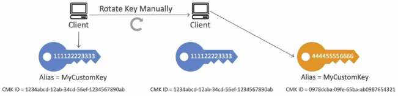

# AWS-Solutions-Architect-Associate (C00-003)
___
# Computing

## Elastic Compute Cloud (EC2)
- Regional Service
- EC2 (Elastic Compote Cloud) is an Infrastructure as a Service
- Stop & Start of an instance may change its public IP but not its private IP
- <b>AWS Compute Optimizer</b> recommends optimal AWS compute resource for your workloads
- There is a vCPU-based On-demand instance soft limit per region

### EC2 User Data
- It is possible to bootstrap our instances using an EC2 User data script
- bootstrapping means launching commands when a machine starts
- Scripts is only run once at the instance first start
- EC2 user data is used to automate boot task such as: 
  - Installing updates
  - Installing software
  - Downloading commons files from the internet
- EC2 User data scripts runs with root user privilege

### Instance Types
- General purpose
  - Great for diversity of workloads such as web servers or code repositories
  - Balance between compute, memory and networking
- Compute Optimized
  - Great for compute intensive task
    - Batch processing
    - Media transcoding
    - High performance computing (HPC)
    - web or gaming servers
- Memory Optimized
  - Fast performance for workloads that process large data sets in memory
  - Great for in-memory databases or distributed web caches
- Storage Optimized
  - Great for storage intensive task (accessing local databases)
  - OLTP systems (uses traditional DBMS)
  - Distributed File System (DFS)

### Security Group
- Security groups only contains allow rules
- Security groups rules can reference a resource by IP or Security Group
- External firewall for EC2 instances (if a request is blocked by SG, instance will never know)
- Security groups are stateful, this means any connection initiated successful will be completed.
- Default SG
  - all inbound traffic is blocked
  - inbound traffic from the same SG is allowed
  - all outbound traffic is allowed
- SG can be attached to multiple instances and vice versa
- Limited to a VPC (and hence to a region)
- Recommended to maintain a separate security group for SSH access
- Blocked request will give a <b>Time out</b> error

### Purchasing Options
- On-demand Instances
  - Pay for what you use (no upfront payment)
  - Has the highest cost
  - No long term commitment
  - Recommended for a <b>short-term and un-interrupted workloads</b>
- Standard Reserved Instances
  - Reservation Period: 1 year(+discount) or 3 years(+++discount)
  - Payment options - No Upfront(+), Partial Upfront(++), All Upfront(+++)
  - Recommended for steady state applications (think database)
  - Sell unused instances on the Reserved Instance Marketplace
  - Reserved Instance's Scope - Regional or Zonal (reserve capacity in an AZ)
- Convertible Reserved Instance
  - Can change the instance type
  - lower discount than Standard Reserved Instance
  - Cannot sell unused instances on the Reserved Instance Marketplace
- Schedule Reserved Instances
  - Reserved for a time window (ex. everyday from 9AM to 5PM)
- Spot Instances
  - Work on a bidding basis where you are willing to pay a specific max hourly rate for the instances. Your instance can terminate if the spot price increase.
  - <b>Spot block</b> are designed not to be interrupted
  - Good for workloads that are resilient to failure
    - batch / distributed jobs
    - data analysis
    - image processing
- Dedicated Hosts
  - Server hardware is allocated to a specific company
  - 1 or 3 year reservation period
  - Useful for software that have complicated licensing model (BYOL - bring you own license) or for companies that have a strong regulatory or compliance needs. 
  - Most expensive option
- Dedicated Instances
  - Dedicated hardware
  - May share hardware with other instances in same account
  - No control over instance placement
- Capacity Reservation
  - Ensure you have the available capacity in a specific AZ for any duration
  - No time commitment, no billing discount
  - You're charged at On-demand rate whether you run instances or not
  
### Spot Instances
- Spot Requests
  - <b>One-time</b>: Request once opened, spins up the spot instances and the request closes.
  - <b>Persistent</b>:
    - Request will stay disabled while the spot instances are up and running
    - It becomes active after the spot instance is interrupted.
    - If you stop the spot instance, the request will become active only after you start the spot instance.
  - You can only cancel spot instance request that are open, active, or disabled.
  - Cancelling a Spot Request doest not terminate instances. you must first cancel a Spot Request, and then terminate the associated Spot Instances.
- Spot Fleets
  - Combination of spot and on-demand instances(optional) that tries to optimize for cost or capacity
  - Launch Templates must be used to have on demand instances in the fleet
  - Can consist of instances of different classes
  - Strategies to allocate Spot Instances:
    - lowestPrices : from the pool with lowest price (cost, optimization, short workload)
    - diversified: distributed across all pools(great for availability, long workloads)
    - capacityOptimized: pool with the optimal capacity for the number of instances.
### Elastic IP
- Static public IP that you own as long as you don't delete it
- Can be attached to an EC2 Instance(even when it is stopped)
- Soft limit of 5 elastic IPs per account
- Doesn't incur charges as long as the following conditions are met
  - is associated with an Amazon EC2 instance
  - instance associated with the elastic IP is running
  - the instance has only one Elastic IP attached to it

### Placement Groups
- Cluster Placement Group (optimize for network)
  - All the instances are placed on the same hardware (same rack)
  - Pros: Great network(10 Gbps bandwidth between instances)
  - Cons: If the rack fails, all instances will fail at the same time
  - Used in HPC (minimize inter-node latency & maximize throughput)
- Spread Placement Group (maximize availability)
  - Each instance is in a separate rack (physical hardware) inside an AZ
  - Supports Multi AZ
  - Up to 7 instances per AZ per placement group (ex. for 15 instances, need 3 AZ)
  - Used for critical applications with need to high availability
- Partition Placement Group (balance of performance and availability)
  - Instances in a partition share rack with each other
  - If the rack goes down, the entire partition goes down
  - Up to 7 partitions per AZ
  - Used in <b>Big Data</b> applications (Hadoop, HDFS, HBase, Kafka, Cassandra)
 
> If you received a capacity error when launching an instance in a placement group that already has running instances, stop and start all of the instances in the placement group, and try the launch again. 
> Restarting the instances may migrate them to hardware that has a capacity for all the requested instances.
  
### Elastic Network Interfaces (ENI)
- ENI is a virtual network card that <b>gives a private IP to an EC2 instance </b>
- A primary ENI is created and attached to the instance upon creation and will be deleted automatically upon instance termination.
- We can create additional ENIs and attach them to an EC2 instance to access it via multiple private IPs.
- We can detach & attach ENIs across instances
- ENIs are tied to the subnet hence to the AZ

### EC2 Instance States
- Stop
  - EBS root volume is preserved
- Terminate
  - EBS root volume is destroyed
- Hibernate
  - Hibernate save the contents from the instance memory(RAM) to the EBS root volume
  - EBS root volume is preserved
  - The instance boots much faster as the OS is not stopped and restarted
  - When you start your instance:
    - EBS root volume is restored to its previous state
    - RAM contents are reloaded
    - Processes that were previously running on the instance are resumed
    - Previously attached data volumes are reattached and the instance retain its instance ID
  - Should be used for application that take a long time to start
  - <b>Not supported for Spot Instance </b>
  - Max hibernation duration = <b>60 days</b>
- Standby
  - Instance remains attached to the ASG but is temporarily put out of service(the ASG doesn't replace this instance)
  - Used to install updates or troubleshoot a running instance.

### EC2 Nitro
- Newer virtualization technology for EC2 Instances
- Better networking options (enhanced networking, HPC, IPv6)
- Higher speed EBS (64,000 EBS input/output operation per seconds (IOPS) max on Nitro instances whereas 32,000 on non-nitro)
- Better underlying security

### vCPU & Threads
- vCPU is the total number of concurrent threads that can be run on an EC2 instance
- Usually 2 threads per CPU core (eg 4CPU cores ⮕ 8vCPU)

### Amazon Machine Image (AMI)
- AMIs are the image of the instance after installing all the necessary OS, software and configure everything
- it boots much faster because the whole thing is pre-packaged and doesnt have to be installed separately for each instance.
- Good for static configurations
- <b>Bound to a region</b> and can be copied across regions
- You can launch EC2 instances from:
  - A public AMI: AWS provided
  - Your own AMI: you make and maintain them yourself
  - An AWS Marketplace AMI: an AMI someone eles made(and potentially sells)

> When the new AMI is copied from region A into region B, it automatically creates a snapshot in region B because AMIs are based on the underlying snapshots.

### Instance Metadata
- URL to fetch metadata about the instance (http://169.254.169.254/latest/meta-data)
- This URL is internal to AWS and can only be hit from the instance

### EC2 Classic & ClassicLink
- Instances run in single network shared with other customers(this is how AWS started)
- <b>ClassicLink</b> allow you to link EC2-Classic instances to a VPC in your account

### Billing
- Reserved instances will be billed regardless of their state (billed for a reservation period)
- On-demand instances in `stopping` state when preparing to hibernate will be billed
- If an instance is running, it will be billed
- In all the other cases, an instance will not be billed

### Run Command
- System Manager <b>Run command</b> lets you remotely and securely manage the configuration of your managed instances. A managed instance is any EC2 instance that has been configured for <b> Systems Manager </b>
- Run command enables you to <b>automate common administrative tasks</b> and perform ad-hoc configuration changes at scale.
- You can use Run Command from the <b>AWS Console,</b> the AWS CLI, Tools for windows, powershell or AWS SDKs. Run command is offered at no additional cost.

### Instance Tenancy
- Default: Instance runs on shared hardware
- Dedicated: Instance runs on single-tenant hardware
- Host: Instance runs on dedicated host  
> - Tenancy of an instance can only be change from host to dedicated or dedicated to host after the instance has been launched
> - Dedicated instance tenancy takes precedence over default instance tenancy

### Troubleshooting
- The following are a few reason why instance might immediately terminate:
  - Reached the limit of EBS volume
  - EBS snapshot is corrupt
  - Root EBS volume is encrypted and you do not have permissions to access on the KMS key for decryption.
  - Instance store-backed AMI that you used to launch the instance is missing a required part

## Elastic Load Balancer (ELB)
- Regional Service
- Support Multi AZ
- Spread load across multiple EC2 Instances
- Separate public tracfic from private traffic
- Health check allow ELB to know which instances are working properly (done on port and a route, `/health` is common)
- <b>Does not support weighted routing</b>
> if no targets are associated with the target groups ⮕ 503 Service Unavailable
> Using ALB & NLB, instances in peered VPCs can be used as targets using IP Addresses.

### Types
<b>Classic Load Balancer (CLB) - deprecated</b>
- Load balancing to a single application
- Supports HTTP, HTTPS (layer 7) & TCP, SSL (layer 3)
- Provides a fixed hostnames (`xxx.region.elb.amazonaws.com`)

<b>Application Load Balancer (ALB) </b>
- Load balancing to multiple applications(target groups)
- Operates at Layer 7 (HTTP, HTTPS and WebSocket)
- Provides a fixed hostname (`xxx.region.elb.amazonaws.com`)
- ALB terminates the upstream connection and creates a new downstream connection to the targets(connection termination)
- <b>Security Groups can be attached to ALBs</b> to filter requests
- Great for micro services & container-based applications (Docker & ECS)
- Client info is passed in the request headers
  - Client IP ⮕ `X-Forwarded-For`
  - Client Port ⮕ `X-Forwarded-Port`
  - Protocol ⮕ `X-Forwarded-Proto`
- Target Groups
  - Health checks are done at the target group level
  - Target Groups could be
    - EC2 instances - HTTP
    - ECS task - HTTP
    - Lambda functions - HTTP request is translated into a JSON event
    - Private IP Addresses
- Listener Rules can be configured to route traffic to a different target groups based on: 
  - Path (example.com/users & exmaple.com/posts)
  - Hostname (one.example.com & other.example.com)
  - Query String (example.com/users?id=123&order=false)
  - Request Headers
  - Source IP address
  

<b>Network Load Balancer (NLB) </b>
- Operates at Layer 4 (TCP, TLS, UDP)
- Can handle millions of request per seconds (extreme performance)
- Lower latency ~ 100ms (vs 400 ms for ALB)
- 1 static public IP per AZ (vs a static hostname for CLB & ALB)
- Elastic IP can be assigned to NLB (helpful for whitelisting specific IP)
- Maintains the same connection from client all the way to the target
- <b>No security groups can be attached to NLBs. </b> They just forward the incoming traffic to the right target group as if those request were directly coming from client. so the <b>attached instances must allow TCP traffic on port 80 from anywhere</b>
- Within a target group, NLB can send traffic to
  - <b>EC2 Instances</b>
    - if you specify targets using an instance ID, traffic is routed to instance using the primary private IP address
  - <b>IP Addresses</b>
    - Used when you want to balance load for a physical server having a static IP.
  - <b>Application Load Balancer (ALB)</b>
    - Used when you want a static IP provided by an NLB but also want to use the features provided by ALB at the application layer.

<b>Gateway Load Balancer (GWLB)</b>
- Operates at layer 4 (Network Layer) - IP protocol
- Used to route requests to a fleet of 3rd party virtual appliances like Firewalls, Intrusion Detection and Prevention System (IDPS), etc
- Performs two functions:
  - Transparent Network Gateway (single entry/exit for all traffic)
  - Load Balancer (distributes traffic to a virtual appliances)
- Uses GENEVE protocol
- Target groups for GWLB could be
  - EC2 instances
  - IP address

### Sticky Sessions (Session Affinity)
- Request coming from client is always redirected to the same instance based on a cookie. After the cookie expires, the request coming from the same user might be redirected to another instance.
- <b>Only supported by CLB & ALB</b>
- Used to ensure the user doesn't lose his session data, like login or cart info, while navigating between web pages.
- <b>Stickiness may cause load imbalance</b>
- Cookies could be
  - Application-based (TTL defined by the application)
  - Load Balancer generated (TTL defined by the load balancer)

### Cross-zone Loading Balancing
- Allows ELBs in different AZ containing unbalanced number of instances to distributes the traffic evenly across all instances in all the AZ registered under a load balancer.
- Supported Load Balancers
  - Classic Load Balancer
    - Disabled by default
    - No charges for inter AZ data
  - Application Load Balancer
    - Always on (can't disabled)
    - No charges for inter AZ data
  - Network Load Balancer
    - Disabled by default
    - Charges for inter AZ data

### In-flight Encryption
- Use an NLB with a TCP listener & terminate SSL on EC2 Instances
- Use an ALB with an HTTPs listener, install SSL certificates on the ALB & terminate SSL on the ALB
- Communication between ALB & EC2 instances can happen over HTTP inside the VPC
- <b>Server Name Indication (SNI)</b>
  - SNI allows us to load multiple SSL certificates on one Load Balancer to serve multiple websites securely
  - <b>Only works for ALB & CLB </b> (CLB only supports one SSL certificates)
  - <b>Supported in Cloudfront</b> also

### Connection Draining (De-registration delay)
- When an instance is to be de-registered from the ELB, the in-flight requests being served by that instance are given some pre-defined time to complete before the ELB de-register it.
- ELB stops sending new requests to the EC2 instance which is de-registering
- Set manually (0 to 3600 seconds) <b>(default : 300 secondss)</b>
> For instances behind an ELB and using ASG, increase the de-registration delay to ensure that the in-flight are completed before the ELB deregisters an instance which is to be terminated by the ASG.

### Access Logs 
- Captures detailed information about requests sent to the load balancer
- Used to analyze traffic patterns and troubleshoot issues
- Disabled by default

### Misc
- Security Group for a public facing ELB
  - ELB will be publicly available on the internet, so its security group should allow HTTP and HTTPS traffic from anywhere. EC2 should only allow traffic from the ELB, so its security group should allow HTTP requests from ELB's security group

## Auto Scaling Group (ASG)
- Regional Service
- Supports Multi AZ
- Automatically add or remove instances (scale horizontally) based on the load
- Free (pay for the underlying resources)
- IAM roles attached to an ASG will get assigned by an ELB (hence replace them)

> - Even if an ASG is deployed across 3 AZs, minimum number of instances to remain highly available is still 2
>
> - If you have an ASG with running instances and, you delete the ASG , The instances will be terminated and the ASG will be deleted.
> 

### Scaling Policies
- <b>Schedule Policies</b>
  - Scale based on a schedule (ex. create the min capacity to 10 at 5PM on Fridays)
  - Used when the load pattern is predictable
- <b>Simple Scaling</b>
  - Scale to certain size on a `CloudWatch` alarm
  - Ex. when CPU > 90%, then scale to 10 instances
- <b>Step Scaling</b>
  - Scale incrementally in steps using `CloudWatch` alarms
  - Ex. when CPU > 70%, then add 2 units and when CPU < 30%, then remove 1 unit
  - Specify the <b>instance warmup time</b> to scale faster
- <b>Target Tracking Scaling</b>
  - ASG maintains a `CloudWatch` metric and scale accordingly (automatically crate CW alarms)
  - Ex. maintain CPU usage at 40%
- <b>Predictive Scaling</b>
  - Historical data is used to predict the load pattern using ML and scale automatically

### Launch Configuration & Launch Template
- Defines the following info for ASG
  - AMI (Instance Type)
  - EC2 User Data
  - EBS Volumes
  - Security Groups
  - SSH Key Pair
  - Min / Max / Desired Capacity
  - Subnets (where the instances will be created)
  - Load Balancer (specify which ELB to attach instances)
  - Scaling Policy
- <b>Launch Configuration (legacy)</b>
  - Cannot be updated (must be re-created)
  - <b>Does not support Spot Instances</b>
- <b>Launch Template (newer)</b>
  - Versioned
  - Can be updated
  - <b>Supports both On-demand and Spot Instances</b>
  - Recommended by AWS

### Scaling Cooldown
- After a scaling activity happens, the ASG goes into cooldown period(default 300 seconds) 
during which it does not launch or terminate additional instances (ignores scaling requests) to allow the metrics to stabilize
- Use a ready to use AMI to launch instances faster to be able to reduce the cooldown period

### Health Checks
- By default, ASG uses the EC2 status check (not the ELB health check). this could explain why some instances that are labelled as unhealthy 
an ELB are still not terminated by the ASG.
- To prevent ASG from replacing unhealthy instances, suspend the <b>ReplaceUnhealthy</b> process type

> ASG creates new scaling activity for terminating the unhealthy instance and then terminates it. 
> Later, another scaling activity launches a new instance to replace the terminated instance.

### Termination Policy 
- Select the AZ with the most number of instances
- Delete the instance with the oldest launch configuration
- Delete the instance which is closes to the next billing hour
> - ASG does not immediately terminate instances with an <b>Impaired</b> status, it waits a few minutes for the instance to recover
> - ASG doesn't terminate an instance that came into service based on EC2 status checks and ELB health checks until the <b>health check grace period</b> expires.
 
### Re-balancing AZs
- ASG ensures that the group never goes below the minimum scale. Actions such as changing the AZ for the group or explicitly terminating
or detaching instances can lead to the ASG becoming unbalanced between AZs. In such cases, ASG compensates by <b>re-balancing</b> 
the AZs by <b>launching new instances before terminating the old ones,</b> so that re-balancing does not compromise the performance or availability of the application.

### Lifecycle Hooks
- Used to perform extra steps before creating or terminating an instance. 
  - Example: 
    - Install some extra software or do some checks (during pending state) before declaring the instance as `in service`
    - Before the instance is terminated (terminating state). extract the log files
  - <b>Without lifecycle hooks, pending and terminating states are avoided</b>

### Attach running instances to an existing ASG
- The running instance must meet the following criteria
  - The AMI used to launch the instance still exists
  - The instance is not a member of another ASG
  - The instance is launch into one of the AZ defined in your ASG

## Lambda

- Function as a Service (FaaS)
- Serverless
- Auto-scaling
- Pay per request (number of invocations) and compute time
- Integrated with `CloudWatch` for monitoring
- <b>Not good for running containerized application </b> 
- Can package and deploy Lambda functions as container images

### Performance
- Increase RAM will improve CPU and network
- RAM: 128 MB - 10GB
- <b>Max execution time: 15 mins</b>
- Disk capacity in function container (`/tmp`): 512 MB
- Environment variables: 4KB

### Deployment
- Deployment size
  - Compressed: 50 MB
  - Uncompressed: 250 MB
- If you intend to reuse code in more than one Lambda function, consider creating a
<b>Lambda Layer</b> (a ZIP archive that contains libraries) for the reusable code. With Layers,
You can <b>use libraries in your function without including them in the deployment package.</b>
Layers let you keep you deployment package small, which makes deployment easier. A function can use up to 
5 layers at a time.

### Networking
- By default, <b>Lambda function operates from an AWS-owned VPC</b> and hence have <b>access to any public internet</b>
or <b>public AWS API</b> (ex. lambda functions can interact with AWS `DynamoDB` APIs to `PutItem`)
- Once a Lambda function is <b>VPC-enabled</b>, all network from your function is subject to 
the routing rules of your VPC/Subnet. If your function needs to interact with a public resource, it will need a
<b>`NAT Gateway`</b>. You should only enable your functions for VPC access when you need to interact with
a private resource located in a private subnet (ex. RDS databse)

> To enable your Lambda function to access resources inside your private VPC, you must provide <b>VPC subnet IDs</b> and 
<b>Security Group IDs</b>. AWS Lamda uses this information to set up ENIs.

### Supported Languages
- Node.js
- Python 
- Java
- C#
- Golang
- Ruby
- Any other language using Custom Runtime API (community supported,Rust)

### Use cases
- Serverless thumbnail creation using S3 & Lambda
- Serverless CRON job using EventBridge & Lambda

### Lambda@Edge
- Deploy Lambda function alongside your `CloudFront` CDN for computing at edge locations
- Customize the CDN content using Lambda at the edge location (responsive)
- No server management (Lambda is deployed globally)
- Pay for what you see (no provisioning)
- Can be used to modify `CloudFront` request & responses.
- We can create a global application using `Lambda@Edge` where `S3` hosts a static website
which uses client side JS to send requests to `CloudFront` which will process the request in a lambda function
in that edge location to perform some operation like fetching data from `DynamoDB`.

## Step Functions
- Used to build <b>serverless workflows</b> to <b>orchestrate Lambda Functions</b>
- Represent flow as a <b>JSON state machine</b>
- Maximum workflow execution time: 1 year
- Features: sequence, parallel, conditions, timeouts, error handling. etc
- Provides a <b>visual graph</b> showing the current state and which path workflow has taken

### Simple Workflow Service (SWF)
- Outdated service (step functions are preferred instead)
- Code runs on EC2 (not serverless)
- <b>Ensures that a task is never duplicated</b> (could replace standard SQS queues)
- 1 year max runtime
- <b>Built-in human intervention step</b>
- Step functions are recommended to be used for new applications, except: 
  - If you need external signals to intervene in the processes
  - If you need child processes that return values to parent processes
___

# Storage
## Instance Store
- <b>Hardware storage directly attached to EC2 instance</b> (cannot be detached and attached to another instance)
- <b>Highest IOPS</b> of any available storage (millions of IOPS)
- Ephemeral storage (losses data when instance is stopped, <b>hibernated</b> or terminated)
- Good for buffer / cache / scratch data / temporary content
- AMI created from an instance does not have its instance store volume preserved

> You can specify the instance store volumes only when you launch an instance. You can't attach instance store volumes
> to an instance after you've launched it
 
### RAID
- <b>RAID 0</b>
  - Improved performance of a storage volume by distributing reads & writes in a stripe across attached volumes
  - If you add a storage volume, you get the straight addition of throughput and IOPS
  - For high performance applications
- <b>RAID 1</b>
  - Improved data availability by mirroring data in multiple volumes
  - For critical applications

## Elastic Block Storage (EBS)
- Volume <b>Network Drive</b> (provides low latency access to data)
- Can only be mounted to 1 instance at a time (except EBS multi-attach)
- <b>Bound to an AZ</b>
- Must provision capacity in advance (size in GB & throughput in IOPS)
- By default, upon instance termination, the root EBS volume is deleted and any other attached EBS volume is not deleted
(can be over-ridden using `DeleteOnTermination` attributes)
- To replicate an EBS volume across AZ or region, need to copy its snapshot
- EBS multi-attach allows the same EBS volume to attach to multiple EC2 instances <b>in the same AZ</b>

> `DeleteOnTermination` attributes can be updated for the root EBS volume only from the CLI

### Volume Type

#### General Purpose SSD
- Good for system boot volumes, virtual desktops
- Storage: 1GB - 16 TB
- **gp3** 
  - **3,000 IOPS baseline** (max 16,000 - independent of size)
  - 125 MiB/s throughput (max 1000 MiB/s - independent of size)
- **gp2**
  - **Burst IOPS up to 3,000**
  - **3 IOPS per GB**
  - **Max IOPS: 16,000** (at 5,334 GB)

#### Provision IOPS SSD
- Optimized for **Transaction-intensive Applications** with high frequency of **small & random IO operations.**
They are sensitive to increased I/O latency.
- Maintain high IOPS keeping I/O latency down by maintaining a **low queue length** and a high number of IOPS available to the volume.
- **Supports EBS Multi-attach** (not supported by other types)
- **io1** or **io2**
  - Storage: 4GB - 16 TB
  - Max IOPS: **64,000 for Nitro EC2 Instances & 32,000 for non-Nitro**
  - **50 IOPS per GB** (64,000 IOPS at 1,280 GB)
  - io2 have more durability and more IOPS per GB (at the assme price as io1)
- **io2 Block Express**
  - Storage: 4GiB - 64 TB
  - Sub-millisecond latency
  - Max IOPS: 256,000
  - 1000 IOPS per GB

#### Hard Disk Drives (HDD)
- Optimized for <b>Through-put intensive Applications</b> that require <b>large & sequential IO operation</b>
and are less sensitive to increase I/O latency (big data, data warehousing, log processing)
- Maintain high throughput to HDD-backed volumes by maintaining a <b>high queue length</b> when 
performing a large, sequential I/O
- <b>Cannot be used as boot volume</b> for an EC2 instance
- Storage: 125 MB - 16 TB
- <b>Throughput Optimized HDD (st1)</b>
  - Optimized for large sequential read and writes (Big data, Data Warehouses, Log processing)
  - <b>Max throughput: 500 MB/s</b>
  - <b>Max IOPS: 500</b>
- <b>Cold HDD (sc1)</b>
  - For infrequently accessed data
  - Cheapest
  - <b>Max throughput: 250: MB/s</b>
  - <b>Max IOPS: 250</b>

### Encryption
- Optional
- For Encrypted EBS volumes
  - Data at rest is encrypted
  - <b>Data in-flight between the instance and the volume is encrypted</b>
  - All the snapshots are encrypted
  - All volumes created from the snapshot are encrypted
- Encrypt an un-encrypted EBS volume
  - Create an EBS snapshot of the volume
  - Copy the EBS snapshot and encrypt the new copy
  - Create a new EBS volume from the encrypted snapshot (the volume will be automatically encrypted)

> All EBS types and all instance families support encryption but not all instance types support encryption.

### Snapshot
- <b>Data Lifecycle Manager (DLM)</b> can be used to automate the creation, retention and deletion of snapshots of EBS volumes.
- Snapshots are incremental
- Only the most recent snapshot is required to restore the volume.

## Elastic File System (EFS)
- AWS managed Network File System (NFS)
- Can be mounted to multiple EC2 instances <b>across AZs</b>
- <b>Pay per use</b> (no capacity provisioning)
- <b>Autoscaling</b> (up to PBs)
- Compatible with <b>Linux</b> based AMIs (<b>POSIX</b> file system)
- <b>Uses security group to control access to EFS</b>
- Lifecycle management feature to move files to <b>EFS-IA</b> after N days

### Performance Mode
- General Purpose(default)
  - latency-sensitive uses cases (web server, CMS, etc.)
- Max I/O
  - higher latency & throughput (big data, media processing)

### Throughput Mode
- Bursting (default)
  - Throughput: 50MB/s per TB
  - Burst of up to 100MB/s
- Provisioned
  - Fixed throughput (provisioned)
### Storage Tiers
- Standard - for frequently accessed files
- Infrequent access (EFS-IA) - cost to retrieve files, lower price to store

### Security
- `EFS Security Group` to control network traffic
- `POSIX Permissions` to control access from hosts by IAM User or Group

## Simple Storage Service (S3)
- Global Service
- Object store (key-value pairs)
- <b>Buckets must have a globally unique name</b>
- Objects have a key (full path to the object): `s3://my_bucket/my_folder/another_folder/my_file.txt`
- The key is composed of bucket + `prefix` + <b>object name</b> + s3://my_bucket/my_folder/another_folder/my_file.txt
- There's no concept of directories within buckets (just keys with very long names that contains slashes)
- <b>Max object size: 5TB</b>
- Durability: 99.99999999999% (total 11 9's)
- <b>SYNC</b> command can be used to <b>copy data between buckets</b>, possibly in <b>different regions</b>
> - S3 delivers <b>strong read after-write consistency</b> (if an object is overwritten and immediately read, `S3` always 
> returns the latest version of the object)
> - S3 is strongly consistent for all `GET`, `PUT` and `LIST` operation

### Bucket Versioning
- Enabled at the bucket level
- Protects against unintended deletes
- Ability to restore to a previous version
- Any file that is not versioned prior to enabling versioning will have version `null`
- Suspending version does not delete the previous versions, just disables it for the future
- To restore a deleted object, delete it's `delete marker`
> - Versioning can only be suspended once it has enabled.
> - Once you version-enable a bucket, it can never return to an un-versioned state

### Encryption
- Can be enabled at the bucket level or a the object level
- #### Server Side Encryption (SSE)
  - SSE-S3
    - Keys managed by S3
    - AES-256 encryption
    - HTTP or HTTPS can be used
    - Must set header: `"x-amz-server-side-encryption":"AES256"`
  - SSE-KMS
    - Keys managed by KMS
    - HTTP or HTTPS can be used
    - KMS provides control over who has access to what keys as well as audit trails
    - Must set header: `"x-amz-server-side-encryption":"aws:ksm"`
  - SSE-C
    - Keys managed by the client
    - Client sends the keys in HTTPS headers for encryption/decryption (S3 discards the key after the operation)
    - <b>HTTPS must be used</b> as key (secret) is being transferred
- #### Client Side Encryption
  - Keys managed by the client
  - Client encrypts the object before sending it to S3 and decrypts it after retrieving it from S3

> <b>Default Encryption</b>: encrypt the files using the default encryption (specify the encryption for the file while uploading to override the default)
> Bucket policy can be used to force a specific type of encryption on the objects uploaded to `S3`

### Access Management 
- #### User based security
  - IAM policies defined which API calls should be allowed for a specific user
  - Preferred over bucket policy for <b>fine-grained access control</b>
- #### Resource based security (Bucket Policy)
  - Grant public access to the bucket
  - Force objects to be encrypted at upload
  - Cross-account access
  - Object access Control List (ACL) - applies to the objects while uploading
  - Bucket access Control List (ACL) - access policy that applies to the bucket

> By default, an S3 object is owned by the account that uploaded it even if the bucket is owned by another
> account. To get full access to the object, the object owner must explicitly grant the bucket owner access.
> As a bucket owner, you can create a bucket policy to require external users to grant `bucket-owner-full-control` when 
> uploading objects so the bucket owner can have full access to the objects.

### S3 Static Websites
- Host static websites (may contain client-side scripts) and have them accessible on the public internet over
<b>HTTP only</b> (for HTTPS, use `CloudFront` with S3 bucket as the origin)
- The website URL will be either of the following:
  - `<bucket-name>.s3-website-<region>.amazonaws.com`
  
- If you get a `403 (forbidden)` error, make sure the bucket policy allows public reads
- For cross-origin access to the `S3` bucket, we need to enable `CORS` on the bucket
- To host an S3 static website on a custom domain using `Route 53`, the bucket name should be the same as your domain
or subdomain `portal.tutorialsdojo.com`, the name of the bucket must be `portal.tutorialsdojo.com`

### MFA Delete
- MFA required to
  - permanently delete on object version
  - suspend versioning on the bucket
- <b>Bucket Versioning must be enabled</b>
- can only be enabled or disabled by root user

### Server Access Logging
- Most detailed way of logging access to S3 buckets (better than `CloudTrail`)
- Does not support <b>Data Events</b> & <b>Log File Validation</b> (use `CloudTrail` for that)
- Store S3 access logs into another bucket
- Logging bucket should not be the same as monitored bucket (logging loop)

### Replication
- <b>Asynchronous replication</b>
- Objects are replicated with the <b>same version ID</b>
- Supports <b>cross-origin</b> and <b>cross-account</b> replication
- <b>Versioning must be enabled for source and destination buckets</b>
- For DELETE operations:
  - Replicate delete markers from source to target (optional)
  - Permanent deletes are not replicated
- There is <b>no chaining of replication</b>. So, if bucket 1 has replication into bucket 2, which has replication into bucket 3,
Then objects created in bucket 1 are not replicated to bucket 3.

### Pre-signed URL
- Pre-signed URLs for S3 have temporary access token as query string parameters which allow anyone with the URL
to temporarily access the resource before the URL expires (default 1 hour)
- Pre-signed URLs inherit the permission of the user who generated it
- Uses:
  - Allow only logged-in users to download a premium video
  - Allow users to upload files to a precise location in the bucket
  
### Storage Classes
- Data can be transitioned between storage classes manually or automatically using lifecycle rules
- Data can be put directly into any storage class
- <b>Standard</b>
  - 99.99% availability
  - Most Expensive
  - Instant retrieval
  - No cost on retrieval (only storage cost)
  - For frequently accessed data
- <b>Infrequent Access</b>
  - For data that is infrequently accessed, but requires rapid access when needed
  - Lower storage cost than Standard but <b>cost on retrieval</b>
  - Can <b>move data into IA from Standard only after 30 days</b>
  - Two types:
    - <b>Standard IA</b>
      - 99.9% availability
    - <b>One-Zone IA</b>
      - 99.5% availability
      - Data is lost if AZ fails
      - Storage for infrequently accessed data that can be easily recreated
- <b>Glacier</b>
  - For data archival
  - Cost for storage and retrieval
  - <b>Can move data into Glacier from Standard anytime</b>
  - Objects cannot be directly accessed, they first need to be restored which could take some time (depending on the tier) to fetch the object
  - <b>Default encryption for data at rest and in-transit</b>
  - Three Types:
    - <b>Glacier Instant Retrieval</b>
      - 99.9% availability
      - Millisecond retrieval
      - Minimum storage duration of <b>90 days</b>
      - Great for data accessed once a quarter
    - <b>Glacier Flexible Retrieval</b>
      - 99.99% availability
      - 3 retrieval flexibility (decreasing order of cost):
        - Expedited (1 to 5 minutes)
          - Can <b>provision retrieval capacity</b> for reliability
          - Without provisioned capacity expedited retrievals might be rejected in situations of high demand
        - Standard (3 to 5 hours)
        - Bulk (5 to 12 hours)
    - <b>Glacier Deep Archive</b>
      - 99.99% availability
      - 2 flexible retrieval:
        - Standard (12 hours)
        - Bulk (48 hours)
      - Minimum storage duration of <b>180 days</b>
      - Lowest cost
- <b>Intelligent Tiering</b>
  - 99.9 availability
  - Move objects automatically between access tiers based on usage
  - Small monthly monitoring and auto-tiering fee
  - <b>No retrieval charges</b>

### Moving between Storage classes

### Lifecycle Rules
- Used to automate transition or expiration actions on S3 objects
- <b>Transition Action</b> (transitioned to another storage class)
- <b>Expiration Action</b> (delete objects after some time)
  - delete a version of an object
  - delete incomplete multi-part uploads
- Lifecycle Rules can be created for a prefix (ex: `s3://mybucket/mp3/*`) or objects tags (ex: Department: Finance)
> - When you apply a retention period to an object version explicitly, you specify a `Retain Until Date` for the object version
> - When you use bucket default settings, you don't specify a `Retain Until Date`. Instead, you specify a duration, for which every object
> version placed in the bucket should be protected.
> - Different versions of a single object can have different retention modes and periods

### S3 Analytics
- Provides analytics to determine when to transition data into different storage classes
- <b>Does not work for ONEZONE_IA & GLACIER</b>

### Performance
- 3,500 PUT/COPY/POST/DELETE and 5,500 GET/HEAD request per seconds per prefix
- Recommended to spread data across prefixes for maximum performance
- SSE-KMS may create a bottleneck in S3 Performance
- Performance Optimization
  - <b>Multi-part Upload</b>
    - Parallelize upload
    - <b>Recommended for files > 100MB</b>
    - <b>must use files > 5GB</b>
  - <b>Byte-range fetches</b>
    - Parallelize download requests by fetching specific byte ranges in each request
    - Better resilience in case of failures since we only refetch the failed byte range and not the whole file
  - <b>S3 Transfer Acceleration</b>
    - Speed up <b>upload and download</b> for large object (> 1GB) for global users
    - Data is ingested at the nearest edge location and is transferred over AWS private network (uses `CloudFront` internally)

### S3 Select
- Select a subset of data from S3 using <b>SQL queries (server-side filtering)</b>
- Less network cost
- Less CPU cost on the client side

### Data Transfer Cost
- Uploads to S3 are free
- Downloads from S3 are paid
- Using S3 Transfer Acceleration, you pay for transfer that are accelerated
- Since buckets are defined within a region, <b>data transfer within a region is free</b>

### S3 Notification Events
- Optional
- Generates events for operations performed on the bucket or objects
- Object name filtering using prefix and suffix matching
- Can create as many `S3 events` as desired
- Targets
  - SNS Topics
  - SQS Standard Queues (not FIFO Queues)
  - Lambda Functions
  - Amazon EventBridge

### Requester Pays Buckets
- Requester pays the cost of the request and the data downloaded from the bucket. The bucket owner only pays for the storage.
- Used to share large datasets with other AWS accounts
- The requester must be authenticated in AWS (cannot be anonymous)

### Object Lock
- WORM (Write Once Read Many) model
- Block an object version modification or deletion for a specified amount of time
- Modes:
  - <b>Governance mode</b>
    - Only users with special permissions can overwrite or delete the object version or alter its lock settings
  - <b>Compliance mode</b>
    - A protected object version cannot be overwritten or deleted by any user, including the root user
    - The object's retention mode can't be changed, and the retention period can't be shortened.
- Glacier Vault Lock
  - WORM (Write Once Read Many) model for Glacier
  - For compliance and data retention
- Legal Hold
  - allow you to prevent an objects and its version from being overwritten or deleted indefinitely.
  - give you the ability to remove it manually

### Access Points
- Each `Access Point` gets it own DNS policy to limit who can access it
  - A specific IAM user/group
  - One policy per Access Point ⮕ Easier to manage complex bucket policies

### S3 Object Lambda
- Use AWS Lambda functions to change the object before it is retrieved by the caller application
- Only one `S3 bucket` is needed, on top which we create <b>S3 Access Point</b> and <b>S3 Object Lambda Access Points</b>

### S3 Batch Operations
- Can perform bulk operations on existing S3 Objects with a single request
  - Modify object metadata & properties
  - Copy objects between S3 bucket
  - <b>Encrypt un-encrypted objects</b>
  - Modify ACLs, tags
  - Restore object from S3 Glacier
  - Invoke Lambda function perform custom action on each object
- managges retries, tracks progress, send completion notification, generate reports
- <b>You can use S3 Inventory to get object list and use S3 Select to filter objects</b>

## S3 Replication (CRR & SRR)
* Must enable versioning in source and destination
* Cross Region Replication (CRR)
* Same Region Replication (SRR)
* Buckets can be in different accounts
* Copying is asynchronous
* Must give proper IAM permissions to S3

> CRR - Use cases: compliance, lower latency access, replication across accounts
> SRR – Use cases: log aggregation, live replication between production and test accounts

* After activating, only new objects are replicated
* Optionally, you can replicate existing objects using S3 Batch Replication
  * Replicates existing objects and objects that failed replication
* **For DELETE operations:**
* Can replicate delete markers from source to target (optional setting)
* Deletions with a version ID are not replicated (to avoid malicious deletes)
* **There is no “chaining” of replication**
* If bucket 1 has replication into bucket 2, which has replication into bucket 3
* Then objects created in bucket 1 are not replicated to bucket 3

## Relational Database (RDS)
- Regional Service
- Supports Multi AZ
- AWS Managed SQL Database
- Supported Engines
  - Postgres
  - MySQL
  - MariaDB
  - Oracle
  - MSSQL
  - Aurora (AWS Managed Database)
- Backed by Elastic Compute Cloud `EC2` storage
- We don't have access to the underlying instance
- <b>DB Connection is made on port 3306</b>
- Security Groups are used for network security (must allow incoming TCP traffic on port 3306 from specific IPs)

### Backups
- <b>Automated Backups</b> (enabled by default)
  - Daily full backup of the database (during the define maintenance window)
  - Backup retention: 7 days (max 35 days)
  - Transaction logs are backed-up every <b>5 minutes</b> (point in time recovery)
- <b>DB Snapshots</b>
  - Manually triggered
  - Backup retention: unlimited

### AutoScaling
- Automatically scales the RDS storage within the max limit
- Condition for automatic storage:
  - Free storage is less than 10% of allocated storage
  - Low-storage lasts at least 5 minutes
  - 6 hours have passed since last modification

### Read Replicas
- Allow us to scale the read operation (SELECT) on RDS
- Up to 5 read replicas (within AZ, cross AZ or cross region)
- Asynchronous Replication (seconds)
- Replicas can be promoted to their own DB
- Applications must update the connection string to leverage read replicas
- Network fee for replication
  - Same region: free
  - Cross region: paid

>You can create a read replica as a Multi-AZ DB instance. A standby of the replica will be created in another AZ for 
> failover support for the replica.

### Multi AZ
- Increase availability of the RDS database by replicating it to another AZ
- Synchronous Replication
- Connection string does not require to be updated(both the database can be accessed by one DNS name, 
which allows for automatic DNS failover to standby database)
- When failing over, <b>RDS flips the CNAME</b> record for the DB instance to point at the standby,
which is in turn promoted to become the new primary
- <b>Cannot be used for scaling as the standby database cannot take read/write operation</b>.

### Encryption
- At rest encryption
  - KMS AES-256 encryption
  - Encrypted DB ⮕ Encrypted Snapshots, Encrypted Replicas and Vice versa
- In flight encryption
  - SSL certificates
  - Force all connections to your DB instance to use SSL by setting the `rds.force_ssl` parameter to `true`
  - To enable encryption in transit, download the <b>AWS-provided root certificates</b> & used them when connecting to DB
  - To encrypt an un-encrypted RDS database:
    - Create a snapshot of the un-encrypted database
    - Copy the snapshot and enable encryption for the snapshot
    - Restore the database from the encrypted snapshot
    - Migrate applications to the new database, and delete the old database

### Access Management
- Username and Password can be used to login the database
- `EC2` instances & `Lambda` functions should access the DB using `IAM DB Authentication` (<b>AWSAuthenticationPlugin</b> with
<b>IAM</b>) - token based access
- EC2 instance or Lambda function has an IAM role which allows to make an API call to the RDS service to get <b>auth token</b>
which uses to access the MySQL Database.
- Only Works with MySQL and Postgres
- Auth token is valid for 15 mins
- Network traffic is encrypted in-flight using SSL
- <b>Central access management using IAM</b> (instead of doing it for each DB individually)

### RDS Events
- RDS event only provide operational events on the DB instance (not the data)
- To capture data modification, events, use <b>native function</b> or <b>store procedures</b> to invoke a `Lambda` function.

### RDS Custom for Oracle and MSSQL Server
- Managed Oracle and MSSQL database with OS and database customization
- RDS: Automates setup, operation and scaling of database in AWS
  - Entire database and the OS to be managed by AWS
- Custom: access to the underlying database and OS, so you can:
  - Configure settings
  - Install patches
  - Enable native features
  - Access underlying EC2 instance using `SSH` or `SSM Session Manager`
  - Full admin access to the underlying OS and Database
- <b>De-active automation mode</b> to perfom your customization, better take a DB snapshot before

### RDS Backup
- Automated backups:
  - Daily full backup of the database (during the maintenance window)
  - Transaction logs are backed-up by RDS every 5 minutes
  - => Ability to restore any point in time (from oldest backup to 5 minutes ago)
  - 1 to 35 days of retention, set 0 to disabled automated backups
- Manual DB Snapshots
  - Manually triggered by the user
  - Retention of backup for as long as you want

> Trick: in a stopped RDS database, you will still pay for storage. If you plan on stopping it for a long time, you should snapshot & restore instead

### RDS Restore
- Restoring RDS backup or snapshot create a new database
- Restoring MySQL RDS database from S3
  - Create a backup of your on-premise database
  - Store it on Amazon S3 (object storage)
  - Restore the backup file onto a new RDS instance running MySql

### RDS Proxy
- Fully managed database proxy for RDS
- Supports: MySQL, PostgreSQL, MariaDB and Aurora (MySQL, PostgreSQL)
- Allows apps to pool and share DB connections established with database
- Improved database efficiency by reducing the stress on the database resources (CPU, RAM)
and minimize open connections (and timeouts)
- Serverless, Autoscaling, Highly available
- <b>Reduced RDS and Aurora failover time by up to 66%</b>
- Enforce `IAM Authentication for DB` and securely store credentials in AWS Secret Manager
- <b>RDS Proxy is never publicly accessible (must be accessed from VPC)</b>

### Monitoring
- `CloudWatch` metrics for RDS
  - Gather metrics from the hypervisor of the DB instance
    - CPU utilization
    - Database Connections
    - Free-able Memory

- Enhanced Monitoring
  - Gathers metric from an agent running on the RDS instance
    - OS processes
    - RDS child processes
  - Used to monitor different <b>processes or threads on a DB instance</b> (ex. percentage of the CPU bandwidth and total memory
  consumed by each database process in your RDS instance)

### Maintenance & Upgrade
Any database engine level upgrade for an RDS DB instance will Multi-AZ deployment triggers both primary and standby DB instances
to be upgraded at the same time. This causes <b>downtime</b> until the upgrade is complete.
This is why it should be done during maintenance window.

## Aurora
- Regional Service (Supports global databases)
- Support Multi AZ
- AWS managed relational DB cluster
- Preferred over `Relational Database Service (RDS)`
- Auto-scaling (max: 128 TB)
- <b>Asynchronous Replication</b> (milliseconds)
- <b>Supports only MySQL & PostgreSQL</b>
- Cloud-optimized (5x performance improvement over MySQL on RDS, over 3x the performance of PostgreSQL on RDS)
- <b>Backtrack</b>: restore data at any point of time without taking backups

### Endpoints
- Writer Endpoint (Cluster Endpoint)
  - Always points to the master (can be used for read/write)
  - Each Aurora DB cluster has one cluster endpoint
- Reader Endpoint
  - Provides load-balancing for read replicas only (used to read only)
  - If the cluster has no read replica, it points to master (can be used to read/write)
  - Each Aurora DB cluster has one reader endpoint
- Custom Endpoint
  - Used to point to a subset of replicas
  - Provides load-balanced based on criteria other than the read-only or read-write capability of the DB instances
like class(ex, direct internal users to low-capacity instances and direct production traffic to high-capacity instances)

### High Availability & Read Scaling
- `Self-healing` (if some data is corrupted, it will be automatically healed)
- Storage is striped across 100s of volumes (more resilient)
- <b>Automated failover</b>
  - A read replica is promoted as the new master in less than 30 seconds
  - Aurora flips the <b>CNAME</b> record for your DB instance to point at the healthy replica
  - In case <b>no replica</b> is available, Aurora will attempt to <b>create a new DB instance</b> in the 
<b>same AZ</b> as the original instance. This replacement of the original instance is done on a <b>best effort basis</b> and may not succeed.
- Support for <b>Cross Region Replication</b>
- Aurora maintains 6 copies of your data across 3 AZ:
  - 4 copies out of 6 needed for writes (can still write if 1 AZ completely fails)
  - 3 copies out of 6 need for reads

> Each Read Replica is associated with a priority tier (0-15). In the event of a failover, Amazon Aurora will promote the Read Replica
> that has the highest priority (lowest tier). If two or more Aurora Replicas share the same tier, then Aurora promotes the replica that is 
> largest in size. If two or more Aurora Replicas share the same priority and size, then Aurora promotes an arbitary replica in the same promotion tier.

### Aurora Backup
- Automated backups
  - 1 to 35 days (cannot be disabled)
  - point in time recovery in that timeframe
- Manual DB Snapshots
  - Manually triggered by the user
  - Retention of backup for as long as you want

### Aurora Restore Options
- Restoring backup or snapshots create a new database
- Restoring MySql Aurora cluster from S3
  - Create a backup of your on-premise database using `Percona XtraBackup`
  - Store the backup file on Amazon S3
  - Restore the `S3` backup file onto a new Aurora cluster running MySQL 

### Aurora Database Cloning
- Create a new Aurora DB Cluster from an existing one
- Faster than snapshot & restore
- DB cluster uses the same cluster volume and data as the original but will change when data updates are made
- <b>Useful to create a staging database from a production database</b>

### Encryption & Network Security
- Encryption at rest using KMS (same as RDS)
- Encryption in flight using SSL (same as RDS)
- You can't SSH into Aurora instance (same as RDS)
- Network Security is managed using Security Groups (same as RDS)
- EC2 instances should access the DB using `IAM DB Authentication` but they can also do it using
credentials fetched from the `SSM Parameter Store` (same as RDS)

### Aurora Serverless
- Optional
- Automated database instantiation and auto scaling based on usage
- Good for unpredictable workloads
- No capacity planning needed
- Pay per second

### Aurora Multi-Master
- Optional
- Every node (replica) in the cluster can read and write
- Used for immediate failover for write node (high availability in terms of write). 
if disabled and the master node fails, need to promote a Read Replica as the new master (will take some time)
- <b>Client needs to have multiple DB connections for failover</b>

### Aurora Global Database
- Entire database is replicated across regions to recover from region failure
- Designed for <b>globally distributed application</b> with <b>low latency local reads</b> in each region
- 1 Primary Region (read/write)
- Up to 5 secondary (read-only) regions (replication lag < 1 second)
- Up to 16 Read Replicas per secondary region
- Helps for decreasing latency for clients in other geographical locations
- <b>RTO of less than 1 minute</b> (to promote another region as primary)

### Aurora Events
- Invoke a `Lambda` function from an Aurora MySQL-compatible DB cluster with a native function or a stored procedure (same as RDS)
- Used to capture data changes whenever a row is modified.

### RDS & Aurora Security
- <b>At-rest encryption</b>:
  - Database master & replicas encryption using AWS-KMS - must be defined as launch time
  - If the master is not encrypted, the read replicas cannot be encrypted
  - To encrypt an un-encrypted database, go-through a DB snapshot & restore as encrypted
- <b>In-flight encryption</b>:
  - TLS-ready by default, use the AWSTLS root certificates client-side
- <b>IAM Authentication</b>: to connect to your database (instead of username/password)
- <b>Security Groups</b>: Control Network access to your RDS / Aurora DB
- <b>No SSH Available</b> except on RDS Custom
- <b>Audit logs can be enabled</b> and sent to `CloudWatch Logs` for longer retention

## DynamoDB
- Serverless NoSQL DB with multi-AZ
- Distributed Database
- Not an in-memory database (uses storage devices)
- Storage auto-scaling
- <b>Single digit millisecond</b> response time at any scale
- <b>Maximum size of an item: 400KB</b>
- Primary key(must be decided at creation) can be a single field or a pair of fields(partition key and sort key)
- Indexes allow us to query on attributes other than the Primary Key
- Supports TTL (automatically delete an item after an expiry timestamp)
- Supports <b>Transactions</b> (either write to multiple tables or write to none)

### Capacity
- <b>Provisioned Mode</b>
  - Provision read & write capacity
  - Pay for the provisioned capacity
  - Auto-scaling option(e.g set RCU and WCU to 80% and the capacities will be scaled automatically based on the workload)
- <b>On-demand Mode</b>
  - Capacity auto-scaling based on the workload
  - Pay for what you use (more expensive)
  - Great for unpredictable workloads

### DynamoDB Accelerator (DAX)
- Caches the queries and scans of DynamoDB items
- Solves read congestion (`ProvisionedThroughputExceededException`)
- <b>Microseconds latency for cached data</b>
- Doesn't require application code changes
- 5 minutes TTL for cache (default)

### DynamoDB Streams
- Ordered stream of notifications of item-level modifications(create/update/delete) in a table 
- Destination can be 
  - Kinesis Data Streams
  - AWS Lambda
  - Kinesis Client Library application
- Data Retention for up to 24hours

### Global Tables
- For low latency access in multiple-regions
- Applications can READ and WRITE to the table in any region and the change will automatically be replicated to other tables (<b>active-active cross region replication</b>)
- <b>Must enable DynamoDB Streams as a pre-requisite</b> 

## ElasticCache
- Regional Service
- AWS managed caching service
- <b>In-memory key value store</b> with <b>sub millisecond latency</b>
- Need to provision an underlying EC2 instance
- <b>Makes the application stateless</b> because it doest have to cache locally
- <b>Using `ElastiCache` requires heavy application code change</b> (setup the application to query the cache before and after querying the database)

### Usage
- DB Cache (lazy loading): cache read operations on a database (reduced latency)
- Session Store: store user's session data like cart info (allows the application to remain stateless)
- Global Data Store: store intermediate computation results

### Redis vs Memcached

| Redis                                                       | Memcached                                            |
|-------------------------------------------------------------|------------------------------------------------------|
| In-memory data store                                        | Distributed memory object cache                      |
| Read Replicas (for scaling reads & HA)                      | No Replication                                       |
| Backup & Restore                                            | No backup & restore                                  |
| Single-thread                                               | Multi-threaded                                       |
| HIPAA compliant                                             | Not HIPAA compliant                                  |
| Data is stored in an in-memory DB which is replicated       | Data is partitioned across multiple nodes (sharding) |
| Redis Sorted Sets are used in realtime Gaming Leadersboards |                                                      |
| Good for auto-completion                                    |                                                      |
| Multi-AZ support with automatic failover (DR)               |                                                      |

> Notes: HIPAA stands for Health Insurance Portability and Accountability Act.

### Security & Access Management
- Network security is managed using <b>Security Groups</b> (only allow EC2 security group for incoming requests)
- At rest encryption using KMS
- in-flight encryption using SSL
- Use <b>Redis Auth</b> to authenticate to `ElastiCache` for `Redis`
- `Memcached` supports SASL-based authentication

## DocumentDB
- think MongoDB (NoSql database)
- Similar deployment concept to Aurora
- Serverless, Fully Managed, High Available with replication across 3AZ
- Storage automatically increments to 10GB upto 64TB
- Auto-scale to workload with millions of request per seconds

## Amazon KeySpaces
- think Apache Cassandra
- Serverless, Scalable, Fully Managed, High Available by AWS
- Tables are replicated 3 times across multiple AZ
- Use Cassandra Query Language (CQL)
- Capacity
  - On demand mode
  - Provisioned mode with autoscaling
- Encryption, backup, Point in time recovery up to 35 days
- Usage:
  - store IoT Devices info, time series data

## Amazon QLDB
- Quantum Ledger Database
- Think of a book recording a financial transactions
- Fully Managed, Serverless, High Available, Replication across 3 AZ by AWS
- Immutable system: no entry can be removed or modified, `cryptograhically` verifiable
- 2-3x better performance than a common ledger blockchain frameworks, manipulate data using SQL
- <b>No Decentralization</b>

## Amazon Timestream
* Fully managed, fast scalable, serverless time series database
* Automatic scale up/down to adjust capacity
* Store and analyze trillions of events per day
* 1000s times faster & 1/10th cost of a relational database
* Near realtime analytics
* Encryption in transit and at rest (same as RDS)
* Usage:
  * IoT apps, operational applications, real-time analytics

## FSx
- Allows us to launch 3rd party high-performance file system on AWS
- Useful when we don't want to use an AWS managed file system like S3
- <b>Can be access from your on-premise infrastructure</b>

### FSx for Windows
- Shared File System for Windows (like EFS but for Windows)
- Supports <b>SMB</b> protocol, Windows <b>NTFS</b>, Microsoft <b>Active Directory</b> integration, ACLs, users qoutas
- Built on SSD, scale up to 10s of GB/s, millions IOPS, 100s PB of data
- Support Multi-AZ (high availability)
- Data is backed-up daily to S3
- Does not integrate with S3 (cannot store cold data)

### FSx for Lustre
- Parallel distributed file system for <b>HPC</b> (like EFS but for HPC)
- Scales up to 100s GB/s, millions of IOPS, sub-ms latencies
- <b>Only works with Linux</b>
- <b>Seamless integration with S3</b>
  - Can read S3 buckets as a file system (through FSx)
  - Can write the output back to S3 (through FSx)
- Ability to both process the <b>hot data</b> in a parallel and distributed fashion as well as easily store the <b>cold data</b> on Amazon `S3`

### FSx Deployment Options
- <b>Scratch File System</b>
  - Temporary storage (cheaper)
  - Data is not replicated (data lost if the file server fails)
  - High burst (6x faster than persistent file system)
  - Usage: short-term processing
- <b>Persistent File System</b>
  - Long term storage (expensive)
  - Data is replicated with same AZ
  - Failed files are replaced within a minutes
  - Usage: long-term processing, sensitive data

## RedShift
- AWS managed data warehouse (10x better performance than other data warehouse)
- Based on <b>PostgreSQL</b>
- Used for <b>Online Analytical Processing (OLAP) and high performing querying</b>
- <b>Columnar storage</b> of data with massively parallel query execution in SQL
- Faster querying than `Athena` due to indexes
- Can be used for both long complex queries as well as short fast queries
- Need to provision instances as a part of the Redshift cluster (pay for the instances provisioned)
- Integrated with <b>Business Intelligence (BI) tools</b> such as `QuickSight` or `Tableau`
- Redshift cluster can have 1 to 128 nodes (128TB per node)
  - <b>Leader Node</b>: query planning & result aggregation
  - <b>Compute Nodes</b>: execute queries & send the result to leader node
- <b>No multi AZ support</b> (all the nodes will be in the same AZ)
- Auto healing feature

### Loading data into RedShift
- <b>S3</b>
  - Use `COPY` command to load data from an S3 bucket into Redshift
  - Without enhanced VPC routing
    - data goes through the public internet
  - Enhanced VPC routing
    - data goes through the VPC without traversing the public internet
- <b>Kinesis Data Firehose</b>
  - Send data to S3 and issues a `COPY` command to load it into Redshift
- <b>EC2 Instance</b>
  - Using JDBC driver
  - Used when an application needs to write data to Redshift
  - Optimal to write data in batches

### Snapshots
- Stored internally in `S3`
- Incremental (only changes are saved)
- Can be restored into a new Redshift cluster
- Automated
  - based on a schedule or storage size (every 5GB)
  - set retention
- Manual
  - retains until you delete them
- Feature to <b>automatically copy snapshots into another region</b>

### RedShift Spectrum
- Query data present in S3 without loading it into Redshift
- Need to have a Redshift cluster to use this feature
- Query is executed by 1000s of Redshift Spectrum nodes
- Consumes much less of your cluster's processing capacity than other queries

## Neptune
- AWS Managed graph database
- Used for high relationship data (e.g networking)
- Highly available access 3 AZ with up to 15 read replicas
- Point in time recovery due to continuous backup to S3
- Support for KMS encryption at rest + HTTPS for inflight encryption
- <b>Need to provision nodes in advance</b> (pay for the provisioned nodes)

## ElasticSearch
- Used in combination with a database to perform <b>search operations on the database</b>
- Can search on any field, even supports <b>partial matches</b>
- <b>Need to provision a cluster of instances</b> (pay for provisioned instances)
- Supports <b>Multi-AZ</b>
- Used in Big data
- Comes with <b>Kibana</b> (virtualization) & <b>Logstash</b> (log ingestion) - ELK stack
- Integrated with `Cognito` for access control

# Network

## Route 53
- Global Service
- AWS managed <b>Authoritative DNS</b> (customer can update the DNS records and have full control over the DNS)
- A `Domain Registrar` (for registering domain names)
- Only AWS service which provides 100% availability SLA
- Affected by client's DNS caching (not suitable for Blue Green Deployment if the client caches DNS queries)

> It is recommended to use DNS names or URLs instead of IPs wherever possible

### Hosted Zone
- A container for DNS records that define how to route traffic to a domain and its subdomains
- Hosted zone is queried to get the IP address from the hostname
- Types:
  - Public Hosted Zone:
    - resolves public domain names
    - can be queried by anyone on the internet
  - Private Hosted Zone
    - resolves private domain names
    - can only be queried from within the VPC

### Record Types
- <b>A</b> - maps a hostname to IPv4
- <b>AAAA</b> - maps a hostname to IPv6
- <b>CNAME</b> - maps a hostname to another hostname
  - Target is a domain name which must have an A or AAAA record
  - <b>Cannot point to root domain (Zone Apex)</b> Ex: you can't create a CNAME record for `example.com` but you can create for `something.example.com`
- <b>NS</b> (Name Server) - control how traffic is routed for a domain
- <b>Alias</b> - maps a hostname to an AWS resource
  - <b>AWS proprietary</b>
  - Can point to root (zone apex) and non-root domains
  - <b>Alias Record is of type A or AAAA (IPv4 / IPv6)</b>
  - Targets can be
    - Elastic Load Balancer (ELB)
    - CloudFront Distributions 
    - API Gateway
    - Elastic Beanstalk environments
    - S3 Websites
    - VPC Interfaces Endpoints
    - Global Accelerator 
    - Route 53 record in the same hosted zone
  - <b>Target cannot be EC2</b>

### Routing Policies
- <b>Simple</b>
  - Route to one or more resources
  - if multiple values are returned. client chooses one at random (client-side load balancing)
  - No health check (if returning multiple resources, some of them might be unhealthy)
- <b>Weighted</b>
  - Route a fraction of request to multiple resources
  - Health checks 
  - Use Case: testing a new application version by sending a small amount of traffic
  - Can be used for <b>Active-Active failover</b> strategy
- <b>Latency Based</b>
  - Redirect to the resource that has the lowest latency
  - Health checks
  - Can be used for <b>Active-Active failover</b> strategy
- <b>Geolocation</b>
  - Routing based on the client's location
  - Should create a `Default` record (in case there's no match on location)
  - Use cases: restrict content distribution & language preference
- <b>Geoproximity</b>
  - Route traffic to your resources based on the proximity of clients to the resources
  - Ability to shift more traffic to resources based on the defined bias.
    - To expand (bias: 1 to 99) ⮕ more traffic to the resource
    - to shrink (bias: -1 to -99) ⮕ less traffic to the resource
  - Uses <b>Route 53 traffic flow</b>
- <b>Multi value</b>
  - Route traffic to multiple resources (max 8)
  - Health checks (only healthy resources will be returned)

### Health Checks
- HTTPS health checks are only for public resources
- Allows for automated DNS failover
- Types
  - Monitor an endpoint (application or other AWS resource)
    - Multiple global health checkers check the endpoint health
    - Must configure the application firewall to allow incoming requests from the IPs of Route 53 Health Checkers
    - Supported protocols: HTTP, HTTPS and TCP
  - Monitor other health checks (<b>Calculated health checks</b>)
    - Combine the results of multiple health checks into one (AND or NOT)
    - Specify how many of the health checks need to pass to make the parent pass
    - Usage: perform maintenance to your website without causing all health checks to fail
  - Monitor Cloudwatch alarms (to perform health check on private resources)
    - Route 53 health checkers are outside the VPC. They can't access private endpoints (private VPC or on-premises resources)
    - Create a `CloudWatch` metric and associate a `CloudWatch Alarm` to it, then create a health check that checks the `CW` alarm

### GoDaddy with Route 53
- Use GoDaddy as registrar and route 53 as DNS
  - Once we register a hostname at GoDaddy, we need to update the name server(NS) of `GoDaddy` to match the name servers of a public hosted zone created
in `Route 53`. This way, `GoDaddy` will use the `Route 53`'s DNS

### DNS Resolution in Hybrid Cloud
- To resolved DNS queries for resources in the VPC from the on-premises network, create an inbound endpoint on `Route 53 Resolver` and then DNS resolvers on the on-promise network
can forward DNS queries to Route 53 Resolver via this endpoint.
- To resolve DNS queries for resources in the on-premises network from the VPC, create an outbound endpoint on Route 53 Resolver and then Route 53 Resolver can conditionally forward queries to resolvers on the on-premises network via this endpoint. To conditionally forward queries, create Resolver rules that specify the domain names for the DNS queries that you want to forward (such as example.com) and the IP addresses of the DNS resolvers on the on-premises network that you want to forward the queries to.

## API Gateway
- Serverless REST APIs
- Invoke Lambda function using REST APIs (API gateway will proxy the request to lambda)
- Supports <b>Websocket</b> (stateful)
- Rate limiting (throttle request) - returns <b>429 Too Many Requests</b>
- Cache API responses
- Transform and validate request and responses
- <b>Can be integrated with any HTTP endpoint in the backed or any AWS API</b>
> - We can use an API Gateway REST API to directly access a DynamoDB table by creating a proxy for the DynamoDB query API
> - API cache is not enabled for a method, it is enabled for a stage

### Endpoints Types
- <b>Edge-Optimized</b>(default)
  - For global clients
  - Requests are routed through the `CloudFront` edge location (improves latency)
  - The API Gateway lives in only one region but it is accessible efficiently through edge locations
- <b>Regional</b>
  - For clients within the same region
  - Could manually combine with your own `CloudFront` distribution for global deployment
    (this way you will have more control over the caching strategies and the distributions)
- <b>Private</b>
  - Can only be accessed within your VPC using an <b>Interface VPC endpoint (ENI)</b>
  - Use resource policy to define access

### Access Management
- <b>IAM Policy</b>
  - Create an IAM policy and attach to User or Role to allow it to call an API
  - Good to provide <b>access within your own AWS account</b>
  - Leverages <b>Sig v4</b> where IAM credential are in the request headers

- <b>Lambda Authorizer</b>
  - Uses a `Lambda` function to validate the token being passed in the header and return an IAM policy to determine
if the user should be allowed to access the resource.
  - Option to cache result of authentication
  - for <b>OATH / SAML / 3rd party type of authentication</b>
  - Good to provide access outside your AWS account if you have an <b>existing IDP</b>
- <b>Cognito User Pools (CUP)</b>
  - <b>Seamless integration with CUP</b> (no custom lambda implementation required)
  - The client (user) first authentication with Cognito and gests the access token which it passes
  in the header to API gateway. API gateway validates the token using Cognito and then hits the backend if the token is valid.

### Serverless CRUD application

## Virtual Private Cloud (VPC)
- Soft limit of 5 VPCs per region
- Only the Private IPv4 ranges are allowed
- AWS accounts have a default VPC
- Default VPC has internet connectivity and all EC2 instances inside it have public IPv4 addresses and public and a private IPv4 DNS names
> - New EC2 instances are launched into the default VPC if no subnet is specified

### Classless Inter-Domain Routing (CIDR)
- Way to define a range of IP addresses
  
- Two parts
  - Base IP - 192.168.0.0
  - Subnet Mask (defines how many bits are frozen from the left side) - /16
- Private IP ranges:
  - 10.0.0.0 - 10.255.255.255 (10.0.0.0/8) ⮕ used in big networks (24 bits can change)
  - 172.16.0.0 - 172.31.255.255 (172.16.0.0/12) ⮕ AWS default VPC
  - 192.168.0.0 - 192.168.255.255 (192.168.0.0/16) ⮕ home networks
- Rest of the IP ranges are Public
- <b>Max 5 CIDR ver VPC</b>
  - Min.size is /28 (16 IP addresses)
  - Max.size is /16 (65536 IP addresses)
  
### Subnet
- Sub-ranges of IP addresses within the VPC
- <b>each subnet is bound to an AZ</b>
- Subnets in a VPC cannot have overlapping CIDRs
- <b>AWS reserves 5 IP addresses (first 4 and last 1 in each subnet</b>. These 5 IP addresses are not available for use. 
  - Example: If CIDR block 10.0.0.0/24, then IP addresses are 10.0.0.0, 10.0.0.1, 10.0.0.2, 10.0.0.3 & 10.0.0.255

> To make the EC2 instances running in private subnets accessible on the internet, place them behind an internet facing
> (running in public subnets) Elastic Load Balancer.
> Public subnets are subnets that have: - Auto-assign public IPv4 address set to `Yes` the subnet route table has an attached Internet Gateway

### Internet Gateway (IGW)
- Allows resources in a VPC to connect to the internet
- Should be used to connect public resources to the internet (use NAT gateway for private resources)
- Route table of the public subnets must be edited to allow requests destined outside the VPC to be routed to the `IGW`
- One IGW per VPC

> IGW performs network address translation (NAT) for a public EC2 instance

### Bastion Host 
- EC2 instance running in the public subnet (accessible from public internet), to allow users to SSH into the instances in the private subnet
- Security groups of the private instances should only traffic from the bastion host
- Bastion host should only port 22 traffic from the IP address you need (<b>small instances are enough</b>)

- <b>High Availability</b>
  - HA options for Bastion Host
    - Run 2 Bastion host across 2 AZ
    - Run 1 Bastion host across 2 AZ with ASG 1:1:1
  - Routing to the bastion host
    - if 1 bastion host, use an elastic IP with EC2 user data script to access it.
    - If 2 bastion host, use a public facing NLB (layer 4) deployed in multiple AZ. Bastion host can live in the private subnet (more secure)
  - Can't use ALB as it works in layer 7 (HTTP protocol) and SSH works with TCP

### Network Address Translation (NAT) Instance
- An `EC2` instance **launched in the public subnet** which allows EC2 instances in private subnets to connect to the Internet without being connected from the internet (blocks inbound connection)
- Must disable EC2 settings: source / destination IP check on the NAT instance as the IPs can change.
- <b>Must have an Elastic IP attached to it</b>
- `Route Tables` for private subnets must be configured to route internet-destined traffic to the NAT instance (its elastic IP)
- <b>Can be used as a Bastion Host</b>
- Disadvantages:
  - Not highly available or resilient out of the box. Need to create an ASG in multi-AZ + resilient user data script
  - Internet traffic bandwidth depends on EC2 Instance type
  - You must manage `Security Groups` & rules:
    - Inbound:
      - Allow HTTP / HTTPS traffic coming from Private Subnets
      - Allow SSH from your home network (access is provided through Internet Gateway `IGW`)
    - Outbound: 
      - Allow HTTP / HTTPS traffic to the internet

### NAT Gateway
- AWS managed NAT with <b>bandwidth autoscaling</b> (up to 45Gbps)
- Preferred over NAT instances
- <b>Uses an Elastic IP</b> behind the scenes
- Bound to an AZ
- Cannot be used by EC2 instance in the same subnet (only from other subnets)
- Cannot be used as a bastion host
- `Route Tables` for private subnets must be configured to route internet destined traffic to the NAT Gateway
- No Security groups to manage
- Pay pey hour

- High Availability
  - Create NAT Gateways in public subnets bound to different AZ all routing outbound connections to the IGW (attached to the VPC)
  - No cross AZ failover needed because if an AZ goes down, all the instances in that AZ also go down

> ### Gateway or Interface Endpoint for S3?
> Gateway is most likely going to be preferred all the time in the exam.
> Cost: free for Gateway, $ for interface endpoint
> Interface Endpoint is preferred access is required from onpremise (Site to Site VPN or direct Connect),
> a different VPC or a different region

### DNS Resolution in VPC
- Two settings need to be enabled to allow DNS resolution within a VPC:
  - <b>DNS Support</b>
    - Allows the resources within the VPC to query the DNS provided by Route 53 Resolver
    - <b>Enabled by default</b>
    - If disabled, we need to provide a custom DNS server otherwise we won't be able to reach hostnames
  - <b>DNS Hostnames (enableDnsHostnames)</b>
    - Assigns <b>public hostname</b> to EC2 instances in our VPC if they have a public IPv4
    - <b>Doesn't work until</b> `enableDnsSupport=true`
    - By default: 
      - Default VPC - Enabled
      - Custom VPC - Disabled
    - When disabled, instances in the VPC will have a public IP but no public DNS
- If you use custom domain names in a private hosted zone in Route 53, you must enable both of these settings

### Network Access Control List (NACL)
- NACL are a firewall at the subnet level
- One NACL per subnet but a NACL can be attached to multiple subnets
- New Subnets are assigned the Default NACL
- Default NACL allows all inboard & outbound requests
- NACL Rules
  - Rules number: 1-32777 (lower number has higher precedence)
  - First rule match will drive the decision
  - The last rule denies the request (only when no previous rule matches)
- Security Group:
  - Firewall for EC2 instances
  - Support only Allow rules
  - Stateful (only request will be evaluated against the SG rules)
  - All rules are evaluated
- NACL with Ephemeral Ports
  - In the example below, the client EC2 instance needs to connect to DB instance. Since the ephemeral port can be randomly assigned from a range of ports, the Web Subnets’s NACL must allow inbound traffic from that range of ports and similarly DB Subnet’s NACL must allow outbound traffic on the same range of ports.

### VPC Peering
- Connect two VPCs (could be in different region or account) using AWS private network
- Participating VPC must have <b>non-overlapping CIDR</b>
- VPC peering connection is <b>non-transitive</b> (A-B, B-C != A-C)
- Must update route tables in each VPC's subnet to ensure request destined to the peered VPC can be routed through the peering connection
- You can reference a security group in a peered VPC across account or region. This allows us to use SG instead of CIDR when configuring rules.

> - VPC Peering does not facilitate centrally managed VPC like `VPC Sharing`

### VPC Endpoints
- <b>Private endpoints</b> within your VPC that allow AWS services to privately connect to resources within your VPC without traversing the public internet (cheaper)
- Powered by `AWS PrivateLink`
- Route table is updated automatically
- <b>Bound to a region</b> (do not support inter-region communication)
- Two types:
  - <b>Interface Endpoint</b>
    - Provisions san `ENI` (private IP) as an entry point per subnet
    - Need to <b>attached a security group to the interface endpoint</b> to control access
  - <b>Gateway Endpoint</b>
    - Provisions a gateway
    - Must be used as a target in a route table
    - Supports only <b>S3</b> and <b>DynamoDB</b>

### VPC Flow Logs 
- Captures information about <b>IP traffic</b> going into your <b>interfaces</b>
- Three levels:
  - <b>VPC</b> flow logs
  - <b>Subnet</b> flow logs
  - <b>ENI</b> flow logs
- Can be configured to show accepted, rejected or all traffic
- Flow logs data can be sent to <b>S3</b> (bulk analytics) or `CloudWatch` Logs (near real-time decision-making)
- Query VPC flow logs using `Athena` in S3 or `CloudWatch Logs Insights`
- Captures network information from AWS managed interfaces too: ELB, RDS, ElastiCache, Redshift, Workspaces, NATGW, Transit Gateway...

### IPv6 Support
- IPv4 cannot be disabled for your VPC
- Enable IPv6 to operate in <b>dual-stack mode</b> in which your EC2 instances will get at least a <b>private IPv4</b> and a <b>public IPv6</b>. 
They can communicate using either IPv4 or IPv6 to the internet through an Internet Gateway
- If you cannot launch an EC2 instance in your subnet, Its not because it cannot acquire an IPv6 (the space is very large).
It's because there are no available IPv4 in you subnet.
<b>Solution: create a new IPv4 CIDR in your subnet</b>

### Egress-only Internet Gateway
- Allow instances in your VPC to initiate outbound connections over IPv6 while preventing inbound IPv6 connections to your private instances 
- Similar to `NAT Gateway` but for IPv6
- Must update `Route table`

> ### VPC Console Wizard
> - Supported configurations:
> - VPC with a single public subnet
> - VPC with public and private subnets (NAT)
> - VPC with public and private subnets and AWS Site to Site VPN access
> - VPC with a private subnet only and AWS Site to Site VPN access

## PrivateLink
- Used to expose services in one VPC to multiple other VPCs, possibly in different accounts
- Should not use VPC peering as we only want to expose a few services
- Requires a `NLB` (common) or `GWLB` in the service VPC and ENI in the consumer VPC
- Use multi-AZ NLB and ENIs in multiple AZ for fault-tolerance

### Exposing ECS task
- ECS tasks require an ALB. So, we can connect the ALB to the NLB for PrivateLink.
- Corporate Data Centers will still connect through the VPN or Direct Connect.

## Site to Site VPN
- Easiest and most cost-effective way to connect a VPC to an on-premise data center
- **IPSec Encrypted** connection through the public internet
- **Virtual Private Gateway (VGW)**: VPN concentrator on the VPC side of the VPN connection
- **Customer Gateway (CGW)**: Software application or physical device on customer side of the VPN connection
If you need to ping EC2 instances from on-premises, make sure you add the ICMP protocol on the inbound rules of your security groups

> Incase Direct Connect fails, you can set up a backup Direct Connect connection (expensive) or a Site to Site VPN connection (cheaper))

## VPN Cloudhub
- **Low-cost hub-and-spoke model for network connectivity between a VPC and multiple on-premise data centers**
- Every participating network can communicate with one another through the VPN connection

## Direct Connect (DX)
- Dedicated private connection from an on-premise data center to a VPC

- 

- **Data in transit is not-encrypted** but the connection is private (secure)
- More stable and secure than Site-to-Site VPN
- Access public & private resources on the same connection using Public & `Private Virtual Interface (VIF)` respectively
- Connection to a data center is made from a Direct Connect Location
- Connects to a `Virtual Private Gateway (VGW)` on the VPC end
- Supports both IPv4 and IPv6
- Supports Hybrid Environments (on premises + cloud)
- **Lead time > 1 month* to establish a new connection

### Connection Types
- Dedicated Connection
  - 1 Gbps and 10 Gbps, 100 Gbps (fixed capacity)
  - Physical ethernet port dedicated to a customer
- Hosted Connection
  - **50Mbps, 500 Mbps, up to 10 Gbps**
  - On-demand capacity scaling (more flexible than dedicated connection)

### Encryption
- For encryption in flight, use AWS Direct Connect + VPN which provides an **IPsec-encrypted private connection**
- Good for an extra level of security

### Resiliency
- **Recommended**

- **Cost-effective way** (VPN connection as a backup)
  - Implement an `IPSec VPN connection` and use the same `BGP prefix`. Both the Direct Connect connection and IPSec VPN are active and being advertised using the `Border Gateway Protocol (BGP)`. 
  - The **Direct Connect link will always be preferred** unless it is unavailable.

### Direct Connect Gateway
- Used to setup a Direct Connect to multiple VPCs, possibly in **different regions but same account**
- Using DX, we will create a Private VIF to the Direct Connect Gateway which will extend the VIF to Virtual Private Gateways in multiple VPCs (possibly across regions).

## Transit Gateway
- **Transitive peering** between thousands of VPCs and on-premise data centers using hub-and-spoke (star) topology
- Works with **Direct Connect Gateway, VPN Connection** and **VPC**
- **Bound to a region**
- Transitive peering between VPCs in **same region & account**
- Route Tables to control communication within the transitive network
- Supports **IP Multicast** (not supported by any other AWS service)

### Increasing BW of Site-to-Site VPN connection
- **ECMP** (equal-cost multi-path) routing is a routing strategy to allow to forward a packet over multiple best path
- To increase the bandwidth of the connection between Transit Gateway and corporate data center, create multiple site-to-site VPN connections, each with 2 tunnels (2 x 1.25 = 2.5 Gbps per VPN connection).
- Only one VPN connection to a VPC having 2 tunnels out of which only 1 is used (1.25 Gbps)

### Share DX between multiple Accounts
Share Transit Gateway across accounts using Resource Access Manager (RAM) connection between VPCs in the same region but different accounts

## Networking Cost
- Inter-AZ and Inter-Region Networking
  - Traffic entering the AWS is free
  - Use Private IP instead of Public IP for good savings and better network performance
  - Traffic leaving an AWS region is paid
  - Use same AZ for maximum savings (at the cost of availability)

### Minimizing Egress Traffic
- Try to keep as much internet traffic within AWS to minimize costs
- Direct Connect location that are co-located in the same AWS Region result in lower cost for egress network

### S3 Data Transfer
- S3 ingress (uploading to S3): free
- S3 to Internet: $0.09 per GB
- S3 Transfer Acceleration:
  - Additional cost on top of Data Transfer (+$0.04 to $0.08 per GB)
- S3 to CloudFront: free (internal network)
- CloudFront to Internet: $0.085 per GB (slightly cheaper than S3)
  - Caching capability (lower latency)
  - Reduced costs of S3 Requests (cheaper than just S3)
- S3 Cross Region Replication: $0.02 per GB

## Reachability Analyzer
- A network diagnostics tool that troubleshoots network connectivity between two endpoints in your VPC
- It builds a model of the network configuration, then checks the reachability based on these configurations (**doesn't send packets, just tests the configurations**)
- When the destination is:
  - Reachable - it produces hop-by-hop details of the virtual network path
  - Not reachable - it identifies the blocking components (e.g. configuration issues In SGs, NACLs, Route Tables, etc.)
- Use cases:
  - Troubleshoot connectivity issues
  - Ensure network configuration is as intended

## Traffic Mirroring
- Capture and inspect network traffic in your VPC without disturbing the normal flow of traffic
- Inbound and outbound traffic through ENIs (eg. attached to EC2 instances) will be mirrored to the destination (NLB) for inspection without affecting the original traffic.
- Capture the traffic
  - From (Source) ENIs
  - To (Targets) an `ENI` or `NLB`
- Source and Target can be in the same or different VPCs (**VPC Peering**)
- Use cases: content inspection, threat monitoring, troubleshooting, etc.

## AWS Network firewall
- Protect the VPC
- Layer 3 to Layer 7 protection
- Can inspect any direction (inbound/outbound)
  - VPC to VPC traffic
  - Inbound/Outbound to internet
  - Direct Connect & Site to Site VPN
- Internally uses AWS Gateway Load Balancer
- Rules can be centralize to `AWS Firewall Maanger` to apply to many VPC
- Traffic filtering: **Allow, drop, alert for the traffic that matches the rules**
- **Active flow inspection** to protect against network threats with intrusion-prevention capabilities 
- Send logs that matches to `S3`, `CloudWatch Logs`, `Kinesis Data Firehose`

# Messaging

## Simple Queue Service (SQS)
- Used to asynchronously decouple applications
- Supports multiple producers & consumers
- When the consumer has successfully processed a message, it is removed from the queue
- Unlimited number of messages in queue
- Max 10 messages per batch
- **Max message size: 256KB**
- **Default message retention: 4 days (max: 14 days)**
- **Consumers could be EC2 instances or Lambda functions**
> SQS cannot ingest data, it must be sent to the queue by the producer (use Kinesis ⮕ Kinesis Data Stream (KDS) instead)

### Queue Types

- **Standard Queue**
  - Unlimited throughput (publish any number of message per second into the queue)
    - Low latency (<10 ms on publish and receive)
    - Can have duplicate messages (at least once delivery)
  - Can have out of order messages (best-effort ordering)
  
- **FIFO Queue**
  - Limited throughput
    - 300 msg/s without batching (batch size = 1)
    - 3000 msg/s with batching (batch size = 10)
  - No duplicate messages
  - Guaranteed ordering of messages
  - **The queue name must end with** `.fifo` to be considered a FIFO queue
  - Sending messages to a FIFO queue requires:
    - **Group ID**: messages will be ordered and grouped for each group ID
    - **Message deduplication ID**: for deduplication of messages

### Consumer Auto Scaling
We can attach an ASG to the consumer instances which will scale based on the CW metric = Queue length / Number of EC2 instances. CW alarms can be triggered to step scale the consumer application.

### Encryption
* In-flight encryption using HTTPS API
* At-rest encryption using KMS keys
* Client-side encryption

### Access Management
* **IAM Policies** to regulate access to the SQS API
* **SQS Access Policies** (resource based policy)
  * Used for cross-account access to SQS queues
  * Used for allowing other AWS services to send messages to an SQS queue

### Configuration

#### **Message Visibility Timeout**

* Once a message is polled by a consumer, it becomes invisible to other consumers for the duration of message visibility timeout. 
After the message visibility timeout is over, the message is visible in the queue.
* If a consumer dies while processing the message, it will be visible in the queue after the visibility timeout
* If a message is not processed within the visibility timeout, it will be processed again (by another consumer). 
However, a consumer could call the `ChangeMessageVisibility` API to change the visibility timeout for that specific message. 
This will give the consumer more time to process the message.
* **Default: 30s**
* Can be configured for the entire queue
  * High: if the consumer crashes, re-processing will take long
  * Low: may get duplicate processing of messages

##### Dead Letter Queue (DLQ)

* An SQS queue used to store failing to be processed messages in another queue
* After the `MaximumReceives` threshold is exceeded, the message goes into the DLQ
* Prevents resource wastage
* Recommended to set a high retention period for DLQ (14 days)

##### Queue Delay

* Consumers see the message after some delay
* Default: 0 (Max: 15 min)
* Can be set at the queue level
* Can override the default queue delay for a specific message using the 
`DelaySeconds` parameter in the message (message timer)

##### Long Polling

* Poll the queue for longer
* Decreases the number of API calls made to SQS (cheaper)
* Reduces latency (incoming messages during the polling will be read instantaneously)
* Polling time: 1 sec to 20 sec
* **Long Polling is preferred over Short Polling**
* Can be enabled at the queue level or at the consumer level by using WaitTimeSeconds

### Request-Response System
* The idea is to build a request-response system where both the requesters and responders can scale independently. 
The requester sends the request into a request queue with attributes “correlation ID” and “reply to”. 
This request will be picked by one of many responders in an ASG. The request will be processed, and it will be sent 
to the right response queue along with the same “correlation ID”. The “correlation ID” will help the requester identify 
which response corresponds to their request.
* To implement this pattern: use the **SQS Temporary Queue Client** which leverages virtual queues instead of 
creating / deleting SQS queues (cost-effective).

### SQS + Lambda + DLQ
Failed messages (after the set number of retries) are sent to the DLQ by the SQS queue

### Handling Priority
> Use two SQS queues, one for low priority (ex. free) and the other for high priority (ex. paid). Configure your 
> consuming application to only poll the low priority queue if the high priority queue is empty.

## Simple Notification Service (SNS)

* Used to broadcast messages
* Pub-Sub model (publisher publishes messages to a topic, subscribers listen to the topic)
* Instant message delivery (does not queue messages)
* Subscribers can be:
* SQS queues
* HTTP / HTTPS endpoints
* Lambda functions
* Emails (using SNS)
* SMS messages
* Mobile Notifications

### Encryption
* In-flight encryption by default using HTTPS API
* At-rest encryption using KMS keys (optional)
* Client-side encryption

### Access Management
* IAM policies to regulate access to the SNS API
* SNS Access Policies (resource based policy)
  * Used for cross-account access to SNS topics
  * Used for allowing other AWS services to publish to an SNS topic

### FIFO Topics
* Guaranteed ordering of messages in that topic
* Publishing messages to a FIFO topic requires:
  * **Group ID**: messages will be ordered and grouped for each group ID
  * **Message deduplication ID**: for deduplication of messages
* **Can only have SQS FIFO queues as subscribers**
* **Limited throughput (same as SQS FIFO)** because only SQS FIFO queues can read from FIFO topics
* **The topic name must end with** `.fifo`

### SNS + SQS Fanout Pattern
* Fully decoupled, no data loss
* SQS allows for: data persistence, delayed processing and retries of work
* Make sure your SQS queue access policy allows for SNS to write

### Message Filtering
* JSON policy used to filter messages sent to SNS topic’s subscriptions
* Each subscriber will have its own filter policy (if a subscriber doesn't have a filter policy, it receives every message)
* Ex: filter messages sent to each queue by the order status

### SNS + Lambda + DLQ
Lambda retries each failed message 3 times after which it is **sent to the DLQ by lambda**

## Kinesis
> Kinesis Agent cannot write to a Kinesis Firehose for which the delivery stream source is already set as Kinesis Data Streams

### Kinesis Data Stream (KDS) 
* Real-time data streaming service
* **Used to ingest data in real time directly from source**
* Throughput
  * Publishing: 1MB/sec per shard or 1000 msg/sec per shard
  * Consuming:
    * 2MB/sec per shard (throughput shared between all consumers)
    * Enhanced Fanout: 2MB/sec per shard per consumer (dedicated throughput for each consumer)
* Throughput scales with shards (manual scaling)
* **Serverless**
* Billing per shard (provisioned)
* **Data Retention: 1 day (default) to 365 days**
* A record consists of a **partition key** (used to partition data coming from multiple publishers) and data blob **(max 1MB)**
* Records will be ordered in each shard
* Producers use SDK, Kinesis Producer Library (KPL) or **Kinesis Agent** to publish records
* Consumers use SDK or Kinesis Client Library (KCL) to consume the records
* **Once data is inserted in Kinesis, it can’t be modified or deleted (immutability)**
* Ability to reprocess (replay) data

### Kinesis Data Firehose (KDF)
* Used to load streaming data into a target location
* **Writes data in batches efficiently (near real time)**
* **Can ingest data in real time directly from source**
* Greater the batch size, higher the write efficiency
* **Auto-scaling**
* **Serverless**
* Destinations:
  * AWS: Redshift, S3, **ElasticSearch**
  * 3rd party: Splunk, MongoDB, DataDog, NewRelic, etc.
  * Custom: send to any HTTP endpoint
* Pay for data going through Firehose (no provisioning)
* **Supports custom data transformation using Lambda functions**
* **Max record size: 1MB**
* No replay capability

### Kinesis Data Analytics (KDA)
* Perform **real-time analytics on Kinesis streams using SQL**
* Create streams from SQL query response
* **Cannot ingest data directly from source** (ingests data from KDS or KDF)
* **Auto-scaling**
* **Serverless**
* Pay for the data processed (no provisioning)
* Use cases:
  * Time-series analytics
  * Real-time dashboards
  * Real-time metrics

## Amazon MQ
* If you have some traditional applications running from on-premise, they may use open protocols such as 
MQTT, AMQP, STOMP, Openwire, WSS, etc. When migrating to the cloud, instead of re-engineering the application to 
use SQS and SNS (AWS proprietary), we can use Amazon MQ (managed Apache ActiveMQ) for communication.
* Doesn't `scale` as much as SQS or SNS because it is provisioned
* Runs on a dedicated machine (can run in HA with failover)
* Has both queue feature (SQS) and topic features (SNS)
### High Availability

* High Availability in Amazon MQ works by leveraging MQ broker in multi AZ (active and standby).
* EFS (NFS that can be mounted to multi AZ) is used to keep the files safe in case the main AZ is down.

## EventBridge
* Extension of CloudWatch ⮕ Events
* Event buses types:
  * **Default event bus**: events from AWS services are sent to this
  * **Partner event bus**: receive events from external SaaS applications
  * **Custom Event bus**: for your own applications
* Event Rules: how to process the events
* **Event buses support cross-account access**
* **Cron Jobs**: when creating an EB rule, we can select `Schedule` instead of event pattern to trigger an event based on a cron expression.
> EventBridge is recommended for decoupling applications that reacts to events from third-party `SaaS` applications.

### Schema Registry
* Defines how the data is structured in the event bus
* Schema can be versioned

# Data Migration & Sync

## Snow Family
* Offline data migration to Simple Storage Service (S3)
* Used when it takes a long time to transfer data over the network
* **Takes around 2 weeks to transfer the data**
* **Snowball cannot import to Glacier directly** (transfer to S3, configure a lifecycle policy to transition the data into Glacier)
* Pay per data transfer job
* Hardware devices for
  * Data Migration (between AWS & on-premise data center)
  * Edge Computing
  * Need to install **OpsHub** software on your computer to manage Snow Family devices

### Snow Devices
* **Snowcone**
  * 2 CPUs, **4GB RAM**, wired or wireless access
  * 8 TB storage
  * USB-C power using a cord or the optional battery
  * Good for space-constrained environment
  * **DataSync Agent** is preinstalled
  * **Does not support Storage Clustering**
* **Snowball Edge**
  * Compute Optimized
    * 52 vCPUs, 208 GB of RAM
    * 42 TB storage
    * Optional GPU (useful for video processing or machine learning)
    * Supports Storage Clustering
  * Storage Optimized
    * Up to 40 CPUs, 80 GB of RAM
    * 80 TB storage
    * Supports Storage Clustering (up to 15 nodes)
    * Transfer up to petabytes
* **Snowmobile**
  * 100 PB storage
  * Used when transferring > **10PB**
  * Transfer up to exabytes
  * **Does not support Storage Clustering**

### Snow Family Data Migration
* **Provides block storage and Amazon S3-compatible object storage**
* Usage process: 
  1. Request Snowball devices from the AWS console for delivery
  2. **Install the snowball client / AWS OpsHub on your servers**
  3. Connect the snowball to your servers and copy files using the client
  4. Ship back the device when you’re done (goes to the right AWS facility)
  5. Data will be loaded into an S3 bucket
  6. Snowball is completely wiped
* Devices for data migration
  * Snowcone
  * Snowball Edge - Storage Optimized
  * Snowmobile

### Snow Edge Computing
* Process data while it’s being created on an edge location (could be anything that doesn’t have internet or access to cloud)
* Long-term deployment options for reduced cost (1 and 3 years discounted pricing)
* Devices for edge computing
  * Snowcone
  * Snowball Edge
* Can run **EC2 Instances & AWS Lambda functions locally on Snow device (using AWS loT Greengrass)**

## Database Migration Service (DMS)
* Migrate entire databases from on-premises to AWS cloud
* The source database remains available during migration
* Continuous Data Replication using CDC (change data capture)
* Requires EC2 instance running the DMS software to perform the replication tasks. If the amount of data is large, 
use a large instance. If multi-AZ is enabled, need an instance in each AZ.

> Most resource-efficient way with the least development and no management, to continuously replicate data to `Redshift` 
> for analytics (first moves data to an S3 bucket and then to Redshift)
> 
> DMS supports S3 as the source and Kinesis as the target, so data stored in an S3 bucket can be streamed to Kinesis. 
> This also supports CDC to stream new data that is put in the S3 bucket.

### Types of Migration
* **Homogeneous Migration**
  * When the source and target DB engines are the same (e.g. Oracle to Oracle)
  * One-step process:
    * Use the `Database Migration Service (DMS)` to migrate data from the source database to the target database
* **Heterogeneous Migration**
  * When the source and target DB engines are different (eg. Microsoft SQL Server to Aurora)
  * Two-step process:
    * Use the `Schema Conversion Tool (SCT)` to convert the source schema and code to match that of the target database
    * Use the `Database Migration Service (DMS)` to migrate data from the source database to the target database 

### Migrating using Snow Family
1. Use the Schema Conversion Tool (SCT) to extract the data locally and move it to the Edge device
2. Ship the Edge device or devices back to AWS
3. After AWS receives your shipment, the Edge device automatically loads its data into an Amazon S3 bucket.
4. AWS DMS takes the files and migrates the data to the target data store (eg. DynamoDB)

## Storage Gateway
* Bridge between on-premises data and S3 for **Hybrid Cloud**
* Not suitable for one-time sync of large amounts of data (use DataSync instead)
* Optimizes data transfer by sending only changed data

### Types of Storage Gateway
* **S3 File Gateway**
  * Used to expand on-premise NFS by leveraging S3
  * Configured S3 buckets are accessible on premises using the `NFS` and `SMB` protocol
  * **Data is cached at the file gateway** for low latency access
  * Can be mounted on many servers on-premises
  * Integrated with Active Directory (AD) for user authentication

  
* **Volume Gateway**
  * Used for on-premise storage volumes
  * Uses iSCSI protocol
  * Two kinds of volumes:
    * **Cached volumes**: storage extension using S3 with caching at the volume gateway
    * **Stored volumes**: entire dataset is on premise, scheduled backups to `S3` as `EBS` snapshots

* **Tape Gateway**
  * Used to back up on-premises data using tape-based process to S3 as Virtual Tapes
  * Uses **iSCSI protocol**

* **FSx File Gateway**
  * Used to expand on-premise Windows-based storage by leveraging FSx for Windows
  * Windows native compatibility (SMB, NTFS, Active Directory)
  * **Data is cached at the file gateway** for low latency access
  

### Storage Gateway - Hardware Appliance
* Storage Gateway requires on-premises virtualization. If you don’t have virtualization available, 
you can use a `Storage Gateway - Hardware Appliance`. It is a mini server that you need to install on-premises.
* Does not work with FSx File Gateway

## DataSync
* Move **large amounts** of data from your on-premises NAS or file system via NFS or SMB protocol to AWS over the **public internet using TLS**
* Can synchronize to:
  * S3 (all storage classes)
  * EFS
  * FSx for Windows
* **Scheduled Replication** (not continuous)
* **Need to install AWS DataSync Agent on premises**

* Can also be used to transfer between AWS storage services

* Suitable in automating and accelerating online data transfers to a variety of AWS storage services (over Storage Gateway which only works with S3)
> Perfect to move large amounts of historical data from on-premises to S3 Glacier Deep Archive (directly).

## AppSync
* Store and **sync data across mobile** and **web apps** in **real-time**
* Makes use of **GraphQL** (mobile technology from Facebook)
* **Offline data synchronization** (replaces Cognito Sync)

## Transfer Family
* AWS managed service to transfer files in and out of Simple Storage Service (S3) using FTP 
(instead of using proprietary methods)
* Supported Protocols
  * FTP (File Transfer Protocol) - unencrypted in flight
  * FTPS (File Transfer Protocol over SSL) - encrypted in flight
  * SFTP (Secure File Transfer Protocol) - encrypted in flight
* Supports Multi AZ
* Pay per provisioned endpoint per hour + fee per GB data transfers
* Clients can either connect directly to the FTP endpoint or optionally through Route 53
* Transfer Family will need permission to read or put data into S3 or EFS

# Access Management

## Identity & Access Management (IAM)
* Global Service (IAM entities like roles can be used in any region without recreation)
> IAM Query API can be used to make direct calls to the IAM web service (using access key ID and secret access key for authentication)

### Users & Groups
* Groups are collections of users and have policies attached to them
* Groups cannot be nested
* User can belong to multiple groups
* User doesn't have to belong to a group
* **Root User** has full access to the account
* **IAM User** has limited permission to the account
* You should log in as an IAM user with admin access even if you have root access. This is just to be sure that nothing goes wrong by accident.

> * An IAM Group is not an identity and cannot be identified as a principal in an IAM policy 
> * Only users and services can assume a role (not groups)
> * A new IAM user created using the AWS CLI or AWS API has no AWS credentials

### Policies
* Policies are JSON documents that outline permissions for users, groups or roles
* Two types
  * **User based policies**
    * IAM policies define which API calls should be allowed for a specific user
  * **Resource based policies**
    * Control access to an AWS resource
    * Grant the specified principal permission to perform actions on the resource and define under what conditions this applies
* An IAM principal can access a resource if the user policy ALLOWS it OR the resource policy ALLOWS it AND there’s no explicit DENY.
* Policies assigned to a user are called inline policies
* Follow the least privilege principle for IAM Policies

* **Trust Policies**
* Defines which principal entities (accounts, users, roles, federated users) can assume the role
* An IAM role is both an identity and a resource that supports resource-based policies.
* You must attach both a trust policy and an identity-based policy to an IAM role.
* The IAM service supports only one type of resource-based policy called a role trust policy, 
which is attached to an IAM role.

### Roles
- Collection of policies for AWS services
> If you are going to use an IAM Service Role with Amazon EC2 or another AWS service that uses Amazon EC2, 
you must store the role in an instance profile. When you create an IAM service role for EC2, the role automatically 
has EC2 identified as a trusted entity.

### Protect IAM Accounts
* **Password Policy**
  * Used to enforce standards for password
    * password rotation
    * password reuse
  * Prevents brute force attack
* **Multi-Factor Authentication (MFA)**
* Both root user and IAM users should use MFA

### Reporting Tools
* **Credentials Report**
  * lists all the users and the status of their credentials (MFA, password rotation, etc.)
  * account level - used to audit security for all the users
* **Access Advisor**
  * shows the service permissions granted to a user and when those services were last accessed
  * user-level
  * used to revise policies for a specific user
  
### Access Keys
* Need to use access keys for AWS CLI and SDK
* Don't share access keys with anyone (every user can generate their own access keys)
* Access keys are only shown once and if you lose them you need to generate new access key
* Access Key ID ~ username
* Secret Access Key ~ password

### Guidelines
* Use root account only for account setup
* 1 physical user = 1 IAM user
* Enforce MFA for both root and IAM users
* Never share lAM credentials & Access Keys

### Policy Simulator
- Online tool that allows us to check what API calls an IAM User, Group or Role is allowed to perform based on the permissions they have.

### Permission Boundaries
* Set the maximum permissions an IAM entity can get
* Can be applied to users and roles (not groups)
* Used to ensure some users can’t escalate their privileges (make themselves admin)

### Assume Role vs Resource-based Policy
* When you assume an IAM Role, you give up your original permissions and take the permissions assigned to the role
* When using a resource based policy, the principal doesn't have to give up their permissions

## Cognito

Amazon Cognito lets you add user sign-up, sign-in, and access control to your web and mobile apps quickly and easily. Amazon Cognito scales to millions of users and supports sign-in with social identity providers, such as Apple, Facebook, Google, and Amazon, and enterprise identity providers via SAML 2.0 and OpenID Connect.

### Cognito User Pools (CUP)
* **Serverless** identity provider (provides sign in functionality for app users)
* Sends back a JSON Web Token (used to verify the identity of the user)
* **MFA support**
* **Supports Federated Identities** allowing users to authenticate via third party identity provider like Facebook, Google, SAML, etc.
* Seamless integration with **API Gateway & ALB** for authentication

### Cognito Identity Pools (CIP)
* Provides temporary credentials (using STS) to users so they can access AWS resources
* Integrates with CUP as an identity provider
* Example use case: provide **temporary access to write to an S3 bucket** after authenticating the user via FaceBook (using CUP identity federation)
  * Can't use S3 pre-signed URL as we need to provide access to a bucket location and not an single object

## Security Token Service (STS)
* Used to grant limited and temporary access to AWS resources
* Token is valid for up to 1h

### AssumeRole
* **Allows IAM Users to assume an IAM Role**
* Steps to assume a role
  * Create an lAM Role (within your account or cross-account)
  * Trust Policy: define which principals should be allowed to assume this role
  * Use STS AssumeRole API to retrieve temporary credentials for the IAM role
  * STS will check with IAM whether or not the user is allowed to assume that role

* Use cases:
  * Safety: deleting a resource first requires users to temporarily assume a role
  * **Cross-account access**: assume role in target account to perform actions there

### AssumeRoleWithSAML
- Allow non IAM users logged in with SAML to assume an IAM role
### AssumeRoleWithWebldentity
* Allow non IAM users logged in via an identity provider (Facebook, Google, etc.) to assume an IAM role
* AWS recommends using Cognito instead

## Identity Federation in AWS
* Federation lets **users outside of AWS to assume temporary role** for accessing AWS resources using a **third-party identity provider**
* **Need to configure IAM roles** with the required policies that users will assume
* No need to create lAM users (user management by the third-party identity provider)
* Need to setup a trust between identity provider and IAM
* Flavors
  * SAML 2.0
  * Custom Identity Broker
  * Web Identity Federation with Amazon Cognito
  * Web Identity Federation without Amazon Cognito (not recommended)
  * Single Sign On
  * Non-SAML with AWS Microsoft AD

### SAML 2.0 Federation
* Used to integrate **Active Directory / ADFS** with AWS using **SAML compatible IDP**
* **Client exchanges SAML assertion for security credentials from STS** using the STS AssumeRoleWithSAML API
> SSO can be implemented using an existing IDP like AD using SAML 2.0 Federation

### Custom Identity Broker Federation
* Used when the identity provider is **not compatible with SAML 2.0 or OIDC**
* **Identity broker gets security credentials from STS** using the STS `AssumeRole` or `GetFederationToken API`
* **Steps in Custom Identity Broker Federation**
* Verify that the user is authenticated by your local IDP (could be AD)
* Call the STS **AssumeRole** or **GetFederationToken API** to obtain temporary security credentials for the user 
* Call the **AWS Federation Endpoint** and supply the temporary security credentials to request a sign-in token

### Web Identity Federation with Cognito
* Use for **OpenID Connect (OIDC) compatible IDP** like CUP, FaceBook, Google etc.
* Example: provide temporary access to write to S3 bucket using Facebook Login
* Steps
  * Log in to federated identity provider to get JWT
  * Use the JWT to authenticate to Federated Identity Pool
  * Get temporary AWS credentials back from the Federated Identity Pool

## AWS Organizations
* **Global service**
* Manage multiple AWS accounts under an organization
  * 1 master account
  * member accounts
* An AWS account can only be part of one organization
* **Consolidated Billing** across all accounts (lower cost)
* Pricing benefits from aggregated usage of AWS resources
* API to automate AWS account creation (on demand account creation)
* Establish Cross Account Roles for Admin purposes where the master account can assume an admin role in any of the children accounts
> Organization API can only create member accounts. They cannot configure anything within those accounts (use CloudFormation for that).

### Organizational Units (OU)
- Folders for grouping AWS accounts of an organization

### Service Control Policies (SCP)
* **Whitelist or blacklist IAM actions at the OU or Account level**
* **Does not apply to the Master Account**
* Applies to all the Users and Roles of the member accounts, including the root user. So, if something is restricted for that account, even the root user of that account won’t be able to do it.
* Must have an explicit allow **(does not allow anything by default)**
* **Does not apply to service-linked roles**
* **Explicit Deny** has the highest precedence

### Migrating Accounts between Organizations
* To migrate member accounts from one organization to another
  1. Remove the member account from the old organization
  2. Send an invitation to the member account from the new organization
  3. Accept the invite from the member account
* To migrate the master account
  1. Remove the member accounts from the organizations using procedure above
  2. Delete the old organization
  3. Repeat the process above to invite the old master account to the new org

## AWS Directory Services
- Used to extend the AD network by involving services like EC2 to be a part of the AD to share login credentials.

> **Exam tip**
> Use AWS Managed Microsoft AD unless the problem specifically asks for properties of AD Connector or Simple AD

### AWS Managed Microsoft AD
* Login credentials are shared between on-premise and AWS managed AD
* **Manage users on both AD** (on-premise and on AWS managed AD)
* Supports MFA
* Establish trust connections with your on premise AD
* Supports **directory-aware workloads on AWS**

### AD Connector
* AD connector will proxy all the requests to the on-premise AD
* **Users are managed on the on-premise AD only**
* Does not support directory-aware workloads on AWS

### Simple AD
* AD-compatible managed directory on AWS (cannot be joined with on-premise AD)
* **Users are managed on the AWS AD only**
* Use when you don’t have an on-premise AD

## AWS Single Sign-On (SSO)
* **Free service**
* **Integrated with AWS Organizations** (login once for your org and you can access all the accounts within that org)
* **Integration with on-premise Active Directory**
* **Supports SAML 2.0**
* Centralized auditing with CloudTrail

### Federated SSO vs AWS SSO
* With Federated SSO, we need to maintain a **3rd party identity provider** (AD/ADFS, CUP, Google, Facebook, custom identity broker) login portal. The IDP returns the JWT or SAML Assertion which the client needs to exchange with STS for login credentials.
* With AWS SSO, we don’t need to manage the login portal, it is done through the AWS SSO. It returns the credentials directly.

# Distribution
## CloudFront
* Global service
* Global Content Delivery Network (CDN)
* **Edge Locations are present outside the VPC**
* Supports HTTP/RTMP protocol **(does not support UDP protocol)**
* **Caches content at edge locations**, reducing load at the origin
* **Geo Restriction feature**
* Improves performance for both cacheable content (such as images and videos) and dynamic content (such as API acceleration and dynamic site delivery)
* To block a specific IP at the CloudFront level, deploy a WAF on CloudFront
* Supports **Server Name Indication** (SNI) to allow SSL traffic to multiple domains

### Origin
* **S3 Bucket**
  * For distributing static files
  * **Origin Access Identity** (OAl) allows the S3 bucket to only be accessed by CloudFront
  * Can be used as ingress to upload files to S3
* **Custom Origin** (for HTTP) - need to be publicly accessible on HTTP by public IPs of edge locations
  * EC2 Instance
  * ELB
  * S3 Website (may contain client-side script)
  * On-premise backend

>To restrict access to ELB directly when it is being used as the origin in a CloudFront distribution, 
> create a VPC Security Group for the ELB and use AWS Lambda to automatically update the CloudFront internal service IP 
> addresses when they change.

### Signed URL / Cookies
* Used to **make a CloudFront distribution private** (distribute to a subset of users)
* Signed URL ⇒ access to individual files
* Signed Cookies ⇒ access to multiple files
* Whenever we create a signed URL / cookie, we attach a policy specifying:
  * URL / Cookie Expiration (TTL)
  * IP ranges allowed to access the data
  * Trusted signers (which AWS accounts can create signed URLs)

### Pricing
* Price Class All: all regions (best performance)
* Price Class 200: most regions (excludes the most expensive regions)
* Price Class 100: only the least expensive regions

### Multiple Origin
* Route to different origins based on the path in the request

### Origin Groups
* Consists of a primary and a secondary origin (can be in different regions)
* Automatic failover to secondary
* Provides region-level High Availability 
* Use when getting 504 (gateway timeout) Error

### Field-level Encryption
* Sensitive information sent by the user is encrypted at the edge close to user which can only be decrypted by the web server (intermediate services can't see the encrypted fields)
* **Asymmetric Encryption (public & private key)**
* Max 10 encrypted field

## Global Accelerator
* Global service
* **Improves availability of the application for global users**
* Leverages the private AWS network to route requests to the application (faster)
* **Supports globally distributed application endpoints**
* **Does not cache anything at the edge location**
* Endpoint could be public or private (could span multiple regions)
  * Elastic IP
  * EC2 instances
  * ALB
  * NLB
* **Endpoint Weights** and **Traffic Dials** are used in Blue-Green Deployment
* **Not affected by client's DNS caching** because the 2 anycast IPs are static (traffic dials and endpoint weights changes are effective within seconds)
* Good for
  * non-HTTP use cases:
    * Gaming (UDP)
    * IoT (MQTT)
    * Voice over IP (VoIP)
  * HTTP use cases that require static IP addresses or fast regional failover

### Working
* 2 any-cast public IPs (static) are created for your application globally. Requests from clients hitting these IPs will automatically be routed to the nearest edge location. The Edge locations send the traffic to your application through the private AWS network.
* Traffic dials to control the percentage of traffic that is directed to an endpoint group (an AWS region where your application is deployed)
* Endpoint weights to determine the proportion of traffic that is directed to endpoints in an endpoint group
### Disaster Recovery
* Global Accelerator performs health checks for the application
* Failover in less than 1 minute for unhealthy endpoints
### Security
* Only 2 static IP need to be whitelisted by the clients
* Can be integrated with AWS Shield for DDoS protection

# Monitoring & Audit

## CloudWatch
- Serverless performance monitoring service
### Metrics
  * Variables to monitor in CloudWatch
    * Dimension is an attribute of a metric (instance id, environment, etc.)
    * Up to 10 dimensions per metric
    * Segregated by namespaces (which AWS service they monitor)
  * **Custom Metrics**
    * Define and send your own custom metrics to CloudWatch using PutMetricData API
    * Metric resolution (StorageResolution API) - frequency of sending metric data
    * Standard: 60 seconds
    * High Resolution: 1/5/10/30 seconds (higher cost)
    * Accepts metric data points two weeks in the past and two hours in the future
  * **EC2 Monitoring**
    * Must run a CloudWatch agent on instance to push system metrics and logs to CloudWatch.
    * EC2 instances have metrics every 5 minutes
    * With detailed monitoring (for a cost), you get metrics every 1 minute
    * Use detailed monitoring if you want to react faster to changes (eg. scale faster for your ASG)
    * Available metrics in CloudWatch:
      * CPU Utilization
      * Network Utilization
      * Disk Performance
      * Disk Reads/Writes
    * Custom metrics:
      * Memory utilization (memory usage)
      * Disk swap utilization
      * Disk space utilization
      * Page file utilization
    * lAM permissions must allow the instance to push logs to CloudWatch
    * CloudWatch agent can be used for logging on premises servers too
    * Can send logs & additional system-level metrics
      * CPU (active, guest, idle, system, user, steal)
      * Disk metrics (free, used, total), Disk IO (writes, reads, bytes, iops)
      * RAM (free, inactive, used, total, cached)
      * Netstat (number of TCP and UDP connections, net packets, bytes)
      * Processes (total, dead, bloqued, idle, running, sleep)
      * Swap Space (free, used, used %)

### Dashboards
* Setup custom dashboards for quick access to key metrics and alarms
* Dashboards are global (allows to monitor services across accounts & regions)
* Dashboards can be shared with people who don’t have an AWS account (public, email address, 3rd party SSO provider through Cognito)
### Logs
* Used to store application logs
* Logs Expiration: never expire, 30 days, etc.
* Logs can be sent to:
  * S3 buckets (exports)
  * Kinesis Data Streams
  * Kinesis Data Firehose
  * Lambda functions
  * ElasticSearch
* **Metric Filters** can be used to filter expressions and use the count to trigger CloudWatch alarms. Example filters:
  * find a specific IP in the logs
  * count occurrences of “ERROR” in the logs
* `Cloud Watch Logs Insights` can be used to query logs and add queries to CloudWatch Dashboards
* Logs can take up to **12 hours to become available for exporting to S3** (not real-time)
* To stream logs in real-time, apply a **Subscription Filter** on logs
* Logs from multiple accounts and regions can be aggregated using subscription filters

>Metric Filters are a part of CloudWatch Logs (not CloudWatch Metrics)

### CloudWatch Alarms
* Alarms are used to trigger notifications for CW metrics based on Metric Filters
* Various options to trigger alarm (sampling, %, max, min, etc.)
* Alarm States:
  * OK
  * INSUFFICIENT_DATA
  * ALARM
* Period:
  * Length of time in seconds to evaluate the metric before triggering the alarm
  * High resolution custom metrics: 10 sec, 30 sec or multiples of 60 sec
* Targets:
  * Stop, Terminate, Reboot, or Recover an EC2 Instance
  * Trigger Auto Scaling Action (ASG)
  * Send notification to SNS

> EC2 Instance Recovery
>
> * CloudWatch alarm to automatically recover an EC2 instance if it becomes impaired
> * Terminated instances cannot be recovered
> * After the recovery, the following are retained
>   * Placement Group
>   * Public IP
>   * Private IP
>   * Elastic IP
>   * Instance ID
>   * Instance metadata
> * After the recovery, RAM contents are lost

### CloudWatch Events
* Schedule or Cron to create events on a schedule
* Uses default event bus (custom & partner event buses are not supported)

### CloudWatch Insights and Operational Visibility
* **CloudWatch Container Insights**
  * ECS, EKS, Kubernetes on EC2, Fargate, needs agent for Kubernetes 
  * Metrics and logs
* **CloudWatch Lambda Insights**
  * Detailed metrics to troubleshoot serverless applications
* **CloudWatch Contributors Insights**
  * Find “Top-N” Contributors through CloudWatch Logs
* **CloudWatch Application Insights**
  * Automatic dashboard to troubleshoot your application and related AWS services

## CloudTrail
* **Global Service** (a single trail can be applied to multiple regions)
* Provides governance, compliance and audit for the AWS Account
* Enabled by default
* Records the API calls made within the AWS account
* **Event retention: 90 days**
* Export CloudTrail logs into
  * CloudWatch Logs
  * S3 (encrypted by default using SSE-S3)

> Modifications to log files can be detected by enabling Log File Validation on the logging bucket

### Event Types
* **Management Events**
  * Events of operations that modify AWS resources. Ex:
    * Creating a new IAM user
    * Deleting a subnet
  * **Enabled by default**
  * Can separate Read Events (that don’t modify resources) from Write Events (that may modify resources)
* **Data Events**
  * Events of operations that modify data
  * S3 object-level activity
  * Lambda function execution
  * **Disabled by default** (due to high volume of data events)
* **Insight Events**
  * Enable `CloudTrail Insights` to detect unusual activity in your account
    * inaccurate resource provisioning
    * hitting service limits
    * bursts of AWS IAM actions
    * gaps in periodic maintenance activity
  * `CloudTrail Insights` analyzes normal management events to create a baseline and then continuously analyzes write events to detect unusual patterns. If that happens, CloudTrail generates insight events that
    * show anomalies in the Cloud Trail console
    * can can be logged to S3
    * can trigger an EventBridge event for automation

### Encryption
* CloudTrail logs are encrypted by default using SSE-S3
* A single KMS key can be used to encrypt log files for trails applied to all regions

## Config
* Regional service
* Can be aggregated across regions and accounts
* Record configurations changes over time
* **Evaluate compliance of resources using config rules**
* **Does not prevent non-compliant actions** from happening (no deny)
* Evaluate config rules
  * for each config change (ex. configuration of EBS volume is changed)
  * at regular time intervals (ex. every 2 hours)
* Can make custom config rules (must be defined in Lambda functions) such as:
  * Check if each EBS disk is of type gp2
  * Check if each EC2 instance is t2.micro
* **Can be used along with CloudTrail** to get a timeline of changes in configuration and compliance overtime.
* **Integrates with** `EventBridge` or `SNS` to trigger notifications when AWS resources are non-compliant

### Remediation
* Automate remediation of non-compliant resources using **SSM Automation Documents**
  * AWS-Managed Automation Documents
  * **Custom Automation Documents**
    * to invoke a Lambda function for automation
* You can set Remediation Retries if the resource is still non-compliant after auto remediation
* Ex. if IAM access key expires (non-compliant), trigger an auto-remediation action to revoke unused IAM user credentials.

## X-Ray
* Provides an **end-to-end view of requests as they travel through your application**, and shows a map of your application’s underlying components.
* AWS X-Ray helps developers analyze and debug production, distributed applications, such as those built using a **micro-services architecture**.
* Helps understand how your application and its underlying services are performing to identify and troubleshoot the root cause of performance issues and errors.
* Can collect data across AWS Accounts. The **X-Ray agent can assume a role** to publish data into an account different 
from the one in which it is running. This enables you to publish data from various components of your application into a **central account**.

## Trusted Advisor
* Service that analyzes your AWS accounts and provides recommendations on:
  * **Cost Optimization**
    * low utilization EC2 instances, EBS volumes, idle load balancers, etc.
    * Reserved instances & savings plans optimizations
  * **Performance**
    * High utilization EC2 instances, CloudFront CDN optimizations
    * EC2 to EBS throughput optimizations, Alias records recommendations
  * **Security**:
    * MFA enabled on Root Account, IAM key rotation, exposed Access Keys
    * S3 Bucket Permissions for public access, security groups with unrestricted ports
  * **Fault Tolerance**:
    * EBS snapshots age, Availability Zone Balance
    * ASG Multi-AZ, RDS Multi-AZ, ELB configuration, etc.
  * **Service Limits**
    * whether or not you are reaching the service limit for a service and suggest you to increase the limit beforehand
* **No installation needed**
* **Weekly email notifications**

## CostExplorer
* Visualize and manage your costs and service usage over time
* Create **custom reports** that analyze cost and usage data
* **Recommendations** to choose an optimal savings plan
* View usage for the **last 12 months & forecast up to 12 months**
> AWS Cost Explorer helps you identify under-utilized EC2 instancess

# Containerization
## Elastic Container Service (ECS)
* Used to launch Docker containers on AWS
* Integrates with ALB for load balancing to ECS tasks
* `EFS` is used as persistent multi-AZ shared storage for ECS tasks

### Launch Types

**EC2 Launch Type**
* **Not Serverless**
* Containers run on underlying EC2 instances
* ECS takes care of launching & stopping containers (ECS tasks)
* You must provision & maintain EC2 instances (use ASG)

**Fargate Launch Type**
* **Serverless**
* No need to provision infrastructure
* No need to worry about infrastructure scaling
* ECS launches the required containers based on the CPU / RAM needed (we won’t know where these containers are running)

## IAM Roles for ECS Tasks
* **EC2 Instance Profile** (IAM role for the EC2 instance)
  * Used by the ECS agent to:
    * Make API calls to ECS service
    * Send container logs to Cloud Watch
    * Pull Docker image from ECR
* **Task Execution Role**
  * Allows ECS tasks to access AWS resources
  * Each task can have a separate role
  * **Use different roles for the different ECS Services**
  * Task Role is defined in the task definition
  * Use `taskRoleArn` parameter to assign IAM policies to ECS Task Execution Role
  * Ex. Reference sensitive data in `Secrets Manager` or `SSM Parameter Store`

### ECS Services
* An ECS Service is a collection of ECS tasks that perform the same function
* We can use ALB to send requests to these tasks
* **Service CPU Usage** or the **SQS queue length** for a service are used for scaling

### Load Balancing
**EC2 Launch Type**
* **Dynamic port is assigned randomly** to ECS tasks
* Once the ALB is registered to a service in the ECS cluster, it will find the right port on the EC2 Instances
* You must **allow on the EC2 instance’s security group any port from the ALB security group** because it may attach on any port

**Fargate Launch Type**
* **Each task has a unique IP but same port (80)**
* You must allow on the ENI’s security group the task port (80) from the ALB security group

### Rolling Updates
* **Minimum healthy percentage** - determines how many tasks, running the current version, we can terminate while staying above the threshold
* **Maximum percentage** - determines how many new tasks, running the new version, we can launch while staying below the threshold
* Min: 50% and Max: 100% and starting number of tasks 4
* Min: 100% and Max: 150% and starting number of tasks 4

### Secrets in ECS tasks¶
* Store the secrets in Parameter Store and encrypt them using KMS
* Reference the secrets in container definition with the name of the environment variable
* Create an **ECS task execution role** and reference it with your task definition, which allows access to both KMS and the Parameter Store/Secrets Manager.
* Supported for both EC2 and Fargate launch types

### Scaling ECS Tasks using EventBridge
* You can use EventBridge (CloudWatch Events) to run Amazon ECS tasks when certain AWS events occur.
* Ex: set up a CloudWatch Events rule that runs an Amazon ECS task whenever a file is uploaded to an S3 bucket. You can also declare a reduced number of ECS tasks whenever a file is deleted from the S3 bucket.

### Troubleshooting Steps
* Verify that the Docker daemon is running on the container instance.
* Verify that the Docker Container daemon is running on the container instance.
* Verify that the container agent is running on the container instance.
* Verify that the IAM instance profile has the necessary permissions.

## Elastic Kubernetes Service (EKS)
* Used to launch Kubernetes (open-source) clusters on AWS
* **Supports both EC2 and Fargate launch types**
* Inside the EKS cluster, we have EKS nodes (EC2 instances) and EKS pods (tasks) within them. We can use a private or public load balancer to access these EKS pods.
* Leverages a Container Storage Interface (CSI) compliant driver
* Support for:
  * Amazon EBS 
  * Amazon EFS (works with Fargate)
  * Amazon FSx for Lustre
  * Amazon FSx for NetApp ONTAP

> CloudWatch Container Insights can be configured to view metrics and logs for an EKS cluster in the CloudWatch console

### Use case
* If your company is already using Kubernetes on-premises or in another cloud, and wants to migrate to AWS using Kubernetes

### Elastic Container Registry (ECR)
* AWS managed private Docker repository
* **Pay for the storage you use** to store docker images (no provisioning)
* Integrated with `ECS` & `IAM` for security
* Storage backed by `S3`
* Can upload Docker images on ECR manually or we can use a CICD service like CodeBuild

## AWS App Runner
* Fully managed service that makes it easy to deploy web applications and APIs at scale
* No infrastructure experience required
* Start with your source code or container image
* Automatically builds and deploy the web app
* Automatic scaling, highly available, load balancer, encryption
* VPC access support
* Connect to database, cache, and message queue services
* Use cases: web apps, APIs, microservices, rapid production deployments

# Deployment
## CloudFormation
* **Infrastructure as Code (IaC)** allows us to write our infrastructure as a config file which can be easily replicated & versioned using Git
* **Declarative** way of outlining your AWS Infrastructure (no need to specify ordering and orchestration)
* Resources within a stack is tagged with an identifier (easy to track cost of each stack)
* Ability to destroy and re-create infrastructure on the fly
* Deleting a stack deletes every single artifact that was created by CloudFormation (clean way of deleting resources)

### CloudFormation Templates
* YAML file that defines a CloudFormation Stack
* **Templates have to be uploaded in S3** and then referenced in CloudFormation
* To update a template, upload a new version of the template
* Template components:
  * **Resources**: AWS resources declared in the template (mandatory)
  * Parameters: Dynamic inputs for your template
  * Mappings: Static variables for your template
  * Outputs: References to what has been created (will be returned upon stack creation)
  * Conditionals: List of conditions to perform resource creation
  * Metadata
* Templates helpers:
  * References
  * Functions
> * You can associate the `CreationPolicy` attribute with a resource to prevent its status from reaching create complete 
> until CloudFormation receives a specified number of `cfn-signal` or the timeout period is exceeded.
> * Use CloudFormation with securely configured templates to ensure that applications are deployed in secure configurations

### Stack Sets
* Create, update, or delete stacks across **multiple accounts and regions** with a single operation
* When you update a stack set, all associated stack instances are updated throughout all accounts and regions.

### Updating Stacks
* CloudFormation provides two methods for updating stacks:
* **Direct update**
  * CloudFormation immediately deploys the submitted changes. You cannot preview the changes.
* **Change Sets**
  * You can preview the changes CloudFormation will make to your stack, and then decide whether to apply those changes.

## Elastic Beanstalk
* Used to **deploy applications** on AWS infrastructure
* **Platform as a Service (PaaS)**
* Automatically handles capacity provisioning, load balancing, scaling, application health monitoring, instance configuration, etc. 
but **we have full control over the configuration**
* **Free** (pay for the underlying resources)
* Supports versioning of application code
* Can create multiple environment (dev, test, prod)
* Supports the deployment of web applications from Docker containers and automatically handles load balancing, auto-scaling, monitoring, and placing containers across the cluster.

### Web & Worker Environments
* Web Environment (Web Server Tier): clients requests are directly handled by EC2 instances through a load balancer.
* Worker Environment (Worker Tier): clients’s requests are put in a SQS queue and the EC2 instances will pull the messages to process them. Scaling depends on the number of SQS messages in the queue.

## Serverless Application Model (SAM)
* Extension of CloudFormation
* **Framework for developing and deploying serverless applications**
* Configuration is **YAML**
* Can run Lambda, API Gateway, DynamoDB locally for development and debugging
* Can use **CodeDeploy** to deploy Lambda functions

### Continuous Integration Continuous Delivery (CICD)
* **Continuous Integration**
  * Developers push the code to a code repository often (GitHub / CodeCommit / Bitbucket)
  * A testing / build server checks the code as soon as it’s pushed (CodeBuild / Jenkins CI)
  * The developer gets feedback about the tests and checks that have passed / failed
  * Deliver faster as the code is tested automatically
* **Continuous Delivery**
  * Ensure that the software can be released reliably whenever needed
  * Ensures deployments happen often and are quick
  * Automated deployment using CodeDeploy, Jenkins CD, etc.
* **Technology Stack for CICD**
  * `AWS CodeCommit` is a fully managed code repository.
  * `AWS CodeBuild` is a fully managed continuous integration (CI) service that compiles source code, runs tests, and produces software packages that are ready to deploy. It is an alternative to Jenkins.
  * `AWS CodeDeploy` is a fully managed deployment service that automates software deployments to a variety of computing services such as EC2, Fargate, Lambda, and your on-premises servers. You can define the strategy you want to execute such as in-place or blue/green deployments.
  * Used to deploy application, not infrastructure (use CloudFormation for that)
  * `AWS CodePipeline` is a fully managed continuous delivery (CD) service that helps you automate your release pipeline for fast and reliable application and infrastructure updates. It automates the build, test, and deploy phases of your release process every time there is a code change. It has direct integration with Elastic Beanstalk.

## Blue-Green Deployment
* Blue-green deployment is a technique to test features in the new environment without impacting the currently running version of your application
  * **Blue** - current version
  * **Green** - new version
* When you’re satisfied that the green version is working properly, you can gradually reroute the traffic from the old blue environment to the new green environment.
* Can mitigate common risks associated with deploying software, such as downtime and **rollback** capability.

## Parameters

# Encryption & Encryption

## Key Management Service (KMS)
* **Regional service (keys are bound to a region)**
* Provides encryption and decryption of data and manages keys required for it
* Encrypted secrets can be stored in the code or environment variables
* **Encrypt up to 4KB of data per call (if data > 4 KB, use envelope encryption)**
* Integrated with lAM for authorization
* Audit key usage with CloudTrail
* Need to set **IAM Policy & Key Policy** to allow a user or role to access a KMS key
### Customer Master Key (CMK)
* **Symmetric keys** (necessary for envelope encryption)
* **Must call KMS API to encrypt data**
* Two types:
  * **AWS Owned CMK** (free)
    * Default KMS key for each supported service
    * Fully managed by AWS (cannot view, rotate or delete them)
  * Customer Owned CMK (1$/month)
    * **AWS Managed CMK**
      * Generated in KMS
      * Option to enable automatic yearly rotation
    * **Customer Managed CMK**
      * Generated and imported from outside
      * Must be 256-bit symmetric key
      * Not recommended
      * Deletion has a waiting period (pending deletion state) between 7 - 30 days (default 30 days). The key can be recovered during the pending deletion state.

### Asymmetric Keys
* Public (Encrypt) and Private Key (Decrypt) pair
* Used for Encrypt/Decrypt, or Sign/Verify operations
* The public key is downloadable, but you can’t access the Private Key unencrypted
* **No need to call the KMS API to encrypt data** (data can be encrypted by the client)
* **Not eligible for automatic rotation** (use manual rotation)
* Use case: encryption outside of AWS by users who can’t call the KMS API

### Key Policies
* Cannot access KMS keys without a key policy
* **Default Key Policy**
  * Created if you don’t provide a specific Key Policy
  * Complete access to the key for the root user ⇒ any user or role can access the key (most permissible)
* **Custom Key Policy**
  * Define users, roles that can access the KMS key
  * Define who can administer the key
  * Useful for cross-account access of your KMS key

### Cross-region Encrypted Snapshot Migration
- Copy the snapshot to another region with re-encryption option using a new key in the new region (keys are bound to a region)

### Cross-account Encrypted Snapshot Migration
- Attach a Key Policy to the main CMK to authorize access to an IAM role in the target account (cross-account access)

* Share the encrypted snapshot with the new account
* In the target account, create a copy of the snapshot (decryption will use the main CMK)
* Encrypt it with a new KMS Key in your account

### Key Rotation
* **Automatic**
  * Supported only in Customer-owned CMK
  * Automatic yearly key rotation
  * Previous key is kept active (to decrypt old data)
  * New key has the same CMK ID (only the backing key is changed)

* **Manual**
  * **New Key has a different CMK ID**
  * Keep the previous key active to decrypt old data
  * Use aliases as CMK id changes after rotation (to hide the key change for the application). After rotation, use UpdateAlias API to point the alias to the new key.
  * **Good for asymmetric keys** (automatic rotation not supported)

### KMS Multi Regions Keys
* Identical KMS keys in different AWS Regions that can be used interchangeably
* Multi-Region keys have the same key ID, key material, automatic rotation... • Encrypt in one Region and decrypt in other Regions
* No need to re-encrypt or making cross-Region API calls • KMS Multi-Region are NOT global (Primary + Replicas)
* Each Multi-Region key is managed independently
> Use cases: global client-side encryption, encryption on Global DynamoDB, Global Aurora

### S3 Replication with Encryption
* Unencrypted objects and objects encrypted with SSE-S3 are replicated by default
* Objects encrypted with SSE-C (customer provided key) are never replicated
* For objects encrypted with SSE-KMS, you need to enable the option
  * Specify which KMS Key to encrypt the objects within the target bucket
  * Adapt the KMS Key Policy for the target key
  * An IAM Role with kms:Decrypt for the source KMS Key and kms:Encrypt for the target KMS Key 
  * You might get KMS throttling errors, in which case you can ask for a Service Quotas increase
* You can use multi-region AWS KMS Keys, but they are currently treated as independent keys 
by Amazon S3 (the object will still be decrypted and then encrypted)

### AMI Sharing Process Encrypted via KMS
1. AMI in Source Account is encrypted with KMS Key from Source Account
2. Must modify the image attribute to add a Launch Permission which corresponds to the specified target AWS account
3. Must share the KMS Keys used to encrypted the snapshot the AMI references with the target account / IAM Role
4. The IAM Role/User in the target account must have the permissions to DescribeKey, ReEncrypted, CreateGrant, Decrypt
5. When launching an EC2 instance from the AMI, optionally the target account can specify a new KMS key in its own account to re-encrypt the volumes

## SSM Parameter Store
* Serverless
* Used to store parameters & secrets
* Parameter versioning
* Seamless Encryption with KMS for encryption and decryption of stored secrets
* Parameters are stored in hierarchical fashion

### Tiers

|                        | Standard Tier | Advance Tier |
|------------------------|---------------|--------------|
| Number of parameters	  | 10,000        | 100,000      |
| Max parameter size	    | 4KB           | 8KB          |
| Parameter Policy	      | Not Supported | Supported    |
| Cost                   | Free          | Paid         |

### Parameter Policies
* Only supported in advanced tier
* Assign policies to a parameter for additional features
* Expire the parameter after some time (TTL)
* Parameter expiration notification
* Parameter change notification

## Secrets Manager
* For storing secrets only
* Ability to force rotation of secrets every n days (not available in Parameter Store)
* A secret consists of multiple key-value pairs
* Secrets are encrypted using KMS
* Mostly used for RDS authentication
  * need to specify the username and password to access the database
  * link the secret to the database to allow for automatic rotation of database login info
* Can create custom secrets

## CloudHSM
* AWS provisions **dedicated encryption hardware** (Hardware Security Module)
* Use when you want to manage encryption keys completely
* HSM device is stored in AWS (tamper resistant, FIPS 140-2 Level 3 compliance)
* **Supports both symmetric and asymmetric encryption**
* Good option to use with **SSE-C encryption**
* CloudHSM clusters are spread across **Multi AZ (high availability)**
* **Redshift supports CloudHSM** for database encryption and key management
* IAM permissions are required to perform CRUD operations on HSM cluster
* **CloudHSM Software** is used to manage the keys and users (in KMS, everything is managed using IAM)

## OpsWorks
* **Chef & Puppet** are two open-source softwares that help you perform **server configuration** automatically, or repetitive actions
* AWS OpsWorks is nothing but **AWS Managed Chef & Puppet**
* They work great with EC2 & On Premise VM
* It’s an **alternative to AWS SSM**
> Exam tip: **Chef & Puppet ⇒ AWS OpsWorks**

## AWS Certificate Manager (ACM)

* Easily provision, manage, and deploy TLS Certificates
* Provide in-flight encryption for websites (HTTPS)
* Supports both public and privateTLS certificates
* Free of charge for publicTLS certificates
* Automatic TLS certificate renewal
* Integrations with (loadTLS certificates on)
  * ElasticLoadBalancers(CLB,ALB,NLB)
  * CloudFront Distributions
  * APIs on API Gateway
* Option to generate the certificate
* outside of ACM and then import it
* No automatic renewal, must import a new certificate before expiry
* ACM sends daily expiration events starting 45 days prior to expiration
* The # of days can be configured
* Events are appearing in EventBridge
* AWS Config has a managed rule named acm-certificate-expiration-check to check for expiring certificates (configurable number of days)

### API GateWay - Endpoint Types
* **Edge-Optimized (default):** For global clients
  * Requests are routed through the CloudFront Edge locations (improves latency)
  * The API Gateway still lives in only one region
* **Regional:**
  * For clients within the same region
  * Could manually combine with CloudFront (more control over the caching strategies and the distribution)
* **Private:**
  * Can only be accessed from your VPC using an interface VPC endpoint (ENI)
  * Use a resource policy to define access

## Firewall Manager
* Manage rules in all accounts of an AWS Organization
* Security policy: common set of security rules
* WAF rules (Application Load Balancer, API Gateways, CloudFront)
* AWS Shield Advanced (ALB, CLB, NLB, Elastic IP, CloudFront)
* Security Groups for EC2, Application Load Balancer and ENI resources in VPC
* AWS Network Firewall (VPC Level)
* Amazon Route 53 Resolver DNS Firewall
* Policies are created at the region level
* Rules are applied to new resources as they are created (good for compliance) across all and future accounts in your Organization

### WAF vs. Firewall Manager vs. Shield
* WAF, Shield and Firewall Manager are used together for comprehensive protection
* Define your Web ACL rules in WAF
* For granular protection of your resources,WAF alone is the correct choice
* If you want to use AWS WAF across accounts, accelerate WAF configuration, automate the protection of new resources, use Firewall Manager with AWS WAF
* Shield Advanced adds additional features on top of AWS WAF, such as dedicated support from the Shield ResponseTeam (SRT) and advanced reporting.
* If you’re prone to frequent DDoS attacks, consider purchasing Shield Advanced

# Analytics

## Athena
* **Serverless** query service to perform analytics on S3
* Uses **SQL language** to query the files
* **Runs directly on S3** (no copying needed)
* Output stored in S3
* Built on **Presto** engine
* Supports CSV, JSON, ORC, AVI and Parquet file formats
> Use compressed or columnar data for cost-savings (due to less scan)
> Can be used along with AWS Transcribe (automatic speech recognition service that converts audio to text) to analyze audio for sentiment analysis.

## Elastic Map Reduce (EMR)
* Used to create **Big Data clusters** to **analyze and process** vast amounts of data
* Uses **Hadoop**, an open-source framework, to distribute your data and processing across a **cluster of 100s of EC2 instances.**
* Supports open-source tools such as **Apache Spark, HBase, Presto, Flink,** etc.
* EMR takes care of all the provisioning and configuration
* **Auto-scaling**
* Integrated with **Spot Instances**
* Can be used to process large amounts of log files

## Glue
* Serverless Extract, Transform & Load (ETL) service
* Used to prepare & transform data for analytics

* Used to get data from a store, process and put it in another store (could be the same store)
> Glue ETL job can write the transformed data using a compressed file format to save storage cost
> 
> Using Glue involves significant development efforts to write custom migration scripts to copy the database data into the target database.

### Glue Data Catalog
* **Glue Data Crawlers** crawl databases and collect metadata which is populated in **Glue Data Catalog**
* Metadata can be used for analytics

## Security

## Disaster Recovery

## Extras